# Master Playwright V1.55+ Docker, Cucumber, Jenkins -SEP'25

## Playwright-1.55-Docker-Cucumber-Jenkins-SEP25

[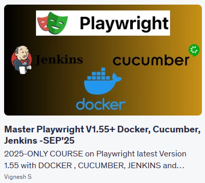](https://www.udemy.com/course/master-Playwright-docker-cucumber-jenkins)

>[!IMPORTANT]
>
>**What you'll learn**
>
> * By end of this course, you will be a master in 2024 `Playwright` with latest version
> * You will be able to build robust framework using `Playwright` + Docker + Cucumber + Jenkins
> * Complete knowledge on how to write test in Cucumber BDD style
> * Complete knowledge on Docker and how to run tests inside docker
> * Complete understanding of `Playwright` Components such as codeGen, fixtures, screenshots and videos
> * Usage of `Playwright` in real world automation end to end testing
> * Gain complete knowledge on Web Automation techniques and tricks
> * Practical knowledge in designing framework from scratch

## Section 1: Introduction


### 1. Must Watch before Enrolling the course

>[!NOTE]
>
>¿Está cansado de buscar un curso de dramaturgia que le resulte difícil mantener
>al día?
>No busque más.
>
>Presentamos nuestro nuevo curso actualizado, repleto de contenidos de vanguardia que elevarán tus habilidades
>a nuevas cotas.
>
>Me he tomado el tiempo de ir más allá y ofrecerle el curso más actualizado del mercado.
>Me complace anunciar que nuestro curso se ha grabado con la última versión de `Playwright`, lo que garantiza
>el aprendizaje de las técnicas más pertinentes y las mejores prácticas.
>Pero eso no es todo.
>
>No pierdas el tiempo con los materiales obsoletos y los vídeos de baja calidad que hay por ahí.
>Únase a nosotros hoy mismo y acceda al curso más completo, actualizado y de mayor calidad sobre dramaturgia disponible
>en el mercado.
>¿A qué esperas?
>Inscríbase ahora y lleve sus habilidades al siguiente nivel con nuestro nuevo curso de dramaturgia.
>

### 2. Important Note Before Starting Course

>[!NOTE]
>
>Antes de empezar con el contenido del curso, tengo una pequeña petición de mi parte solicitando a todos ustedes que den
>
>una calificación de cinco estrellas a este curso.

### 3. Important to WATCH

>[!NOTE]
>
>Has llegado a la página de este curso a través de una búsqueda en Udemy, de un anuncio de Google o de cualquier otra plataforma
>social.
>
>Te pido que te tomes un momento para comprar el curso a través del truco que te voy a mostrar ahora.
>Así que para todos los cursos que tengo, Udemy me da cupones cada mes para añadir descuentos a esos cursos.


### 4. Course Introduction

>[!NOTE]
>
>`Playwright` es un marco de automatización web de código abierto desarrollado por Microsoft.
>Entonces todos nos preguntaremos por qué elegir `Playwright` en lugar de otras herramientas de automatización.
>
>Porque `Playwright` es el futuro de las pruebas de automatización web.
>`Playwright` gana por goleada a todas las herramientas de automatización existentes como `Selenium`, `Cypress`, WebDriver, IO e incluso puppeteer
>debido a las abundantes características empaquetadas en `Playwright` que no están disponibles en estas herramientas.
>Este curso está bien estructurado y diseñado para principiantes.
>
>Si no tienes conocimientos previos sobre `Playwright` o incluso sobre el lenguaje como TypeScript, entonces este es el curso
>adecuado para ti.
>Porque como parte de este curso, junto con el `Playwright`, también te enseñaré el lenguaje TypeScript
>desde cero.
>

### 5. Course Content Walkthrough

>[!NOTE]
>
>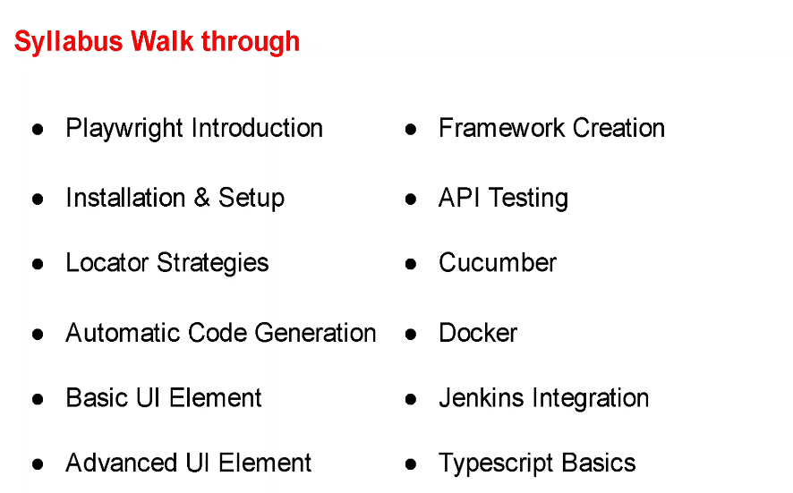
>
> * El primer tema es la interacción entre `Playwright`.
>Aquí aprenderemos en detalle sobre `Playwright` junto con sus arquiteSyllabus Walk throughcturas y las características que
>ofrecen.
>
> * Y en segundo lugar vamos a aprender acerca de la instalación y configuración aquí.
>En esta sección, aprenderemos paso a paso la configuración de cómo instalar `Playwright` en varios sistemas operativos
>y cómo configurar el proyecto.
>
> * Y en la siguiente sección veremos nuestras estrategias.
>Aquí aprenderemos diferentes estrategias de localización y cómo utilizarlas para automatizar la interfaz de usuario web.
>
> * Y la siguiente sección es la generación automática de código.
>Esta es una de las grandes características que ofrece `Playwright`, donde aprenderemos a autogenerar el código
>de `Playwright` sin escribir una sola línea de código.
>
> * La siguiente sección es un elemento básico de la interfaz de usuario.
>Aquí aprenderemos a manejar los elementos básicos de interfaz de usuario en `Playwright`, como cuadro de texto, botones, casilla
>de verificación, botón de radio, etcétera.
>
> * Y el siguiente tema es el elemento UI avanzado.
>Aquí aprenderemos a manejar los elementos avanzados de la interfaz de usuario web, como alertas, marcos de calendario, etcétera.
>
> * A continuación aprenderemos sobre la creación del marco.
>Este es uno de los temas cruciales de este curso.
>Aquí aprenderemos a crear un framework de primera desde cero.
>
> * La próxima sección tratará sobre las pruebas.
>Junto con las pruebas de interfaz de usuario, también aprenderemos a realizar pruebas de API utilizando `Playwright`.
>
> * La siguiente sección es el `Cucumber`.
>Aprenderemos a integrar cucumber con `Playwright` para escribir el test estilo BDD.
>
> * La siguiente sección es Docker.
>Aprenderemos a integrar el Docker con `Playwright` para ejecutar la prueba `Playwright` dentro del contenedor
>Docker.
>
> * Y la siguiente es la integración con Jenkins.
>Aprenderemos a crear un proyecto Jenkins y a ejecutar las pruebas a través del pipeline Jenkins.
>
> * Y el último tema sería lo básico de TypeScript.
>Cubriremos TypeScript desde lo básico hasta temas avanzados.

### 6. How to Reach out to Instructor

>[!NOTE]
>
>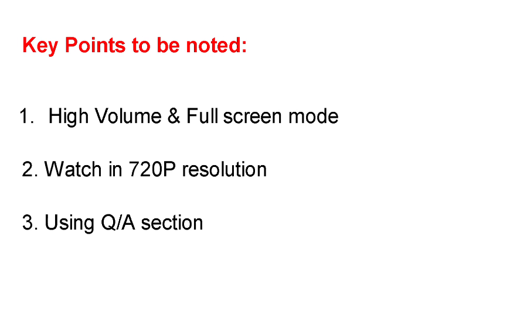

### 7. What is `Playwright` ?

>[!NOTE]
>
>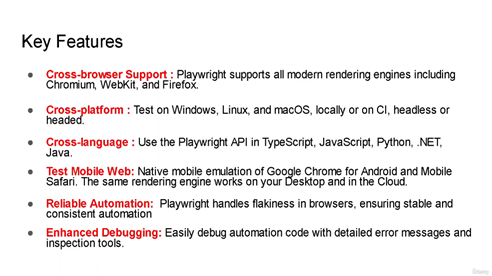
>
>En este video, vamos a entender en profundidad qué es `Playwright` y cuáles son las grandes características
>que `Playwright` nos ofrece.
>
>En primer lugar, aprenderemos qué es un `Playwright`.
>`Playwright` es un marco de automatización web de código abierto desarrollado por Microsoft.
>Es un Nodo. js herramienta de automatización de bibliotecas.
>
>`Playwright` está escrito en TypeScript, que es un superconjunto de JavaScript que añade tipado estático opcional
>y otras características al lenguaje.
>
>Veamos ahora cuáles son las principales características que ofrece el `Playwright`.
>
> * **La característica clave más importante es la compatibilidad entre navegadores**. <br/>
>`Playwright` es compatible con todos los motores de renderizado modernos, incluidos chromium, WebKit y Firefox.
>Por lo tanto, si escribe su prueba una vez en `Playwright` test, puede ejecutar estas pruebas en todos los navegadores
>que desee.
>
> * **La segunda característica clave importante es la prueba multiplataforma en windows, Linux y macOS de forma local o en headless o header.** <br/>
>Lo que significa que `Playwright` es compatible para trabajar con cualquier sistema operativo y se ejecutará incluso en local
>o incluso en cualquiera como Jenkins o Circleci, tanto en modo headless como headed.
>
> * **La siguiente característica es el lenguaje cruzado.**<br/>
>Mediante la API de `Playwright`, podemos escribir el script de `Playwright` en TypeScript, JavaScript,
>Python, DotNet e incluso en Java.
>
> * **La siguiente característica importante es probar la emulación móvil nativa de Google Chrome para Android y Safari para móviles.**<br/>
>El mismo motor de renderizado funciona en un ordenador de sobremesa y en la nube.
>Cuando escribimos nuestra prueba `Playwright`, además de probar en el navegador web, también podemos modificar nuestra prueba para que
>se ejecute de la misma forma que funciona en los navegadores móviles.
>
> * **La siguiente es la automatización fiable.**<br/>
>`Playwright` gestiona los fallos del navegador, garantizando una automatización estable y coherente.
>La siguiente función es la depuración mejorada.
>
> * **Depure fácilmente el código de automatización con herramientas detalladas de inspección y mensajes de error**. <br/>
>Siempre que se produzca un fallo en nuestra prueba de `Playwright`, `Playwright` le dará un mensaje de error detallado
>e incluso le indicará dónde se produce el error, junto con las herramientas de inspección.
><br/><br/>
>
>La siguiente característica clave es la automatización.
>Esta es una de las características más importantes del `Playwright`.
>
>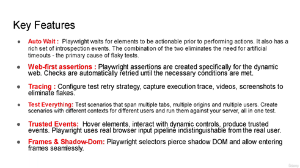
>
> * **El `Playwright` espera a que los elementos sean accionables antes de realizar las acciones.**<br/>
>También cuenta con un rico conjunto de eventos de introspección.
>La combinación de ambos elimina la necesidad de tiempos de espera artificiales, que es la causa principal de las pruebas
>defectuosas.
>Cuando trabaje con `Playwright`, ya no tendrá que mencionar el tiempo de espera manualmente.
>Playwright lo hace automáticamente por nosotros.
>
> * **La siguiente característica clave son las afirmaciones _web first_.**<br/>
>Las aserciones de `Playwright` se crean específicamente para la web dinámica.
>Los cheques se retiran automáticamente hasta que se cumplen las condiciones necesarias.<br/>
>Playwright incorpora aserciones especialmente diseñadas para la automatización web.
>
> * **La siguiente función es el rastreo**.
>   * Configurar este retroceso.
>   * Estrategia.
>   * Captura.
>   * Ejecución.
>   * Rastro.
>   * Vídeos.
>   * Capturas de pantalla.
>
>Para eliminar la flexión.
>Incluso podemos configurar para rastrear la prueba cuando hay un fallo.
>
> * **La siguiente es probarlo todo.**</b>
>Los escenarios de prueba que abarcan varias pestañas, varios orígenes e incluso varios usuarios pueden probarse fácilmente
>con `Playwright`.
>Cree escenarios con diferentes contextos para diferentes usuarios y ejecútelos en su servidor.
>Todo en una sola prueba.
>
> * **La siguiente función es Eventos de confianza.**
>Sin embargo, los elementos que interactúan con los controles dinámicos.
>Producir eventos de confianza.
>`Playwright`,
>Utilizar canalizaciones de entrada de navegador reales indistinguibles del usuario real.
>Usando `Playwright`, podemos crear eventos de confianza para el navegador, que se asegurará de cómo el usuario en tiempo
>real lo utiliza.
>
> * **El siguiente es Frames y _Shadow-DOM_**.<br/>
>El `Playwright` nos selecciona.
>Perfora el domo de sombra y permite entrar en los marcos sin problemas.
>Esta es una de las características clave de `Playwright` que no ofrecen otras herramientas de automatización.
>
>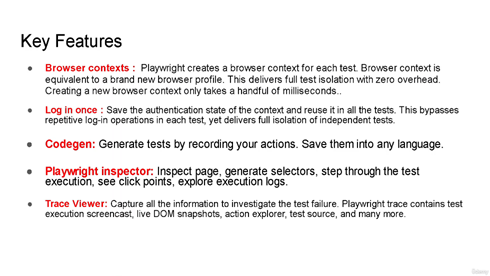
>
> * **Contexto del navegador**. <br/>
>`Playwright` crea un contexto de navegador para cada prueba.
>El contexto del navegador equivale a un nuevo perfil de navegador.
>Así se consigue un aislamiento total de las pruebas sin sobrecarga.
>Crear un nuevo contexto de navegación sólo lleva un puñado de milisegundos.
>Cada prueba se ejecutará en un nuevo contexto, lo que significa que una prueba no obstaculizará la ejecución de otras.
>
> * **La siguiente característica clave es el inicio de sesión.**<br/>
>Una vez, guarda el estado de autenticación de automatización del contexto, y lo reutiliza en todas las pruebas.
>Así que si tu
>UI necesita una autenticación, entonces tenemos que guardar que sólo una vez.
>Usando `Playwright` rest, todo se manejará solo.
>
> * **La siguiente función es la cadena de código.**
>Esta es de nuevo una característica muy importante en `Playwright`, donde esta función de entrenamiento nos ayuda a generar la prueba mediante el
>registro de nuestras acciones en la interfaz de usuario, y creará automáticamente la prueba `Playwright` para nosotros.
>Ni siquiera necesitamos escribir manualmente la prueba.
>
> * La siguiente función es la de inspector de `Playwright`.
>Podemos inspeccionar la página, generar los selectores y recorrer la ejecución de la prueba viendo los puntos
>de clic y explorando los registros de ejecución.
>Este inspector `Playwright` nos ayuda en la obtención de los localizadores, e incluso a ver el paso a paso de la ejecución de
>la prueba.
>La siguiente función clave es Trace Weaver, que captura toda la información para investigar el fallo de la prueba.
>`Playwright`.
>Trace contiene la ejecución de la prueba, screencast, instantáneas en vivo Dom, acciones Happen y el recurso de prueba,
>y muchos más.
>

### 8. Architecture of `Playwright` vs. Other Automation Tools

>[!NOTE]
>
>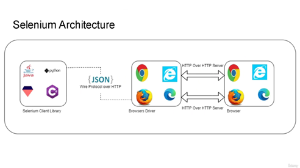
>
>A modo de comparación, tomemos el `Selenium`.
>`Selenium` es una popular herramienta de automatización de código abierto utilizada para validar aplicaciones web en diferentes navegadores.
>
>En primer lugar, entendamos la arquitectura del `Selenium`.
>`Selenium` trabaja sobre el protocolo de conexión Http.
>Esto significa que después de activar la prueba, todo el código `Selenium` escrito por nosotros, que es
>el cliente, se convertirá a formato Json.
>
>El Json generado se envía al controlador del navegador, que es un servidor a través del protocolo Http, y el controlador del navegador
>comunica el código correspondiente al navegador.
>En este caso, el controlador actúa como intermediario entre el cliente y el navegador.
>
>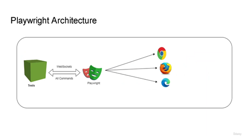
>
>Ahora veamos al `Playwright`.
>Arquitectura.
>
>Aunque `Playwright` funciona con un protocolo de conexión WebSocket, esto significa que una vez que lance la prueba, el
>código se ejecutará directamente en el navegador.
>En `Playwright` no existe el concepto de conductor de navegador intermediario.
>
>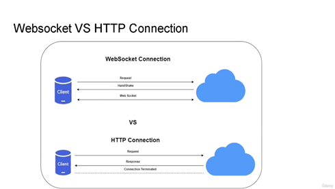
>
>Ahora veremos cuál es la diferencia entre la conexión WebSocket frente al protocolo de conexión Http.
>
> * `Selenium` envía cada comando como una petición Http separada y recibe respuestas Json.
>Así, cada acción como abrir el navegador, hacer clic en un elemento o enviar teclas en un cuadro de texto se envía como
>una petición Http independiente.
>Además, tras la finalización de cada solicitud, se terminará la conexión entre el servidor
>y el cliente, que deberá restablecerse para la siguiente solicitud.
>Terminación de la conexión.
>Después de cada solicitud resultan en una ejecución más lenta, lo que introduce una capa de flakiness.
>
> * `Playwright`, por su parte, comunica todas las peticiones a través de una única conexión WebSocket,
>que se mantiene hasta que finaliza la ejecución del texto.
>Esto reduce los puntos de fallo y permite que los comandos se envíen rápidamente en una sola conexión.
>
>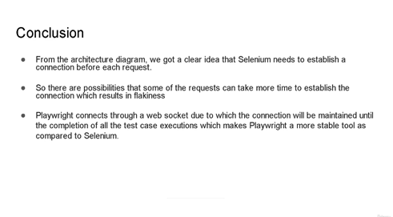
>
> * En conclusión, a partir del diagrama de arquitectura, tenemos una idea clara de que `Selenium` necesita establecer una
>conexión antes de cada solicitud.
>
> * Por tanto, existe la posibilidad de que algunas de las peticiones tarden más tiempo en establecer la conexión,
>lo que se traduce en flaqueza.
>
> * Mientras que `Playwright` se conecta a través de un WebSocket, debido a lo cual la conexión se mantendrá hasta la finalización
>de todos los casos de prueba.
>Ejecución que hace de `Playwright` una herramienta más estable en comparación con `Selenium`.
>
>En el próximo vídeo, veremos cuáles son las ventajas en tiempo real de utilizar `Playwright` frente a otras herramientas
>del mercado.
>

### 9. Real time Advantages of using Playwright

>[!NOTE]
>
>En este vídeo, veremos en detalle cuáles son las ventajas de `Playwright` frente a las herramientas de automatización existentes
>en el mercado.
>
>Para este ejemplo, tomaremos las dos principales herramientas que conducen a las pruebas de automatización web.
>Uno es el `Selenium` y el otro es `Cypress`.
>
>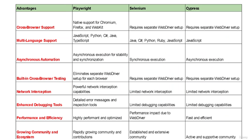
>
>Ahora veamos esta tabla una a una para entender las ventajas de `Playwright` frente a `Selenium`
>y `Cypress`.
>
> * La primera ventaja es **la compatibilidad entre procesos**.<br/>
>`Playwright` por soportes nativos para chromium, Firefox y WebKit, mientras que para `Selenium` requiere una configuración
>WebDriver separada, y para `Cypress` requiere una configuración WebDriver separada también.
>
> * Y en cuanto a **la compatibilidad multilingüe**. <br/> `Playwright` admite JavaScript, Python, C-sharp, Java e incluso TypeScript.
>Mientras que `Selenium` soporta Java, C, sharp, Python, Ruby y JavaScript, mientras que `Cypress` sólo se ejecutará
>en JavaScript.
>
> * La siguiente es **la automatización asíncrona**.<br/>
>Ejecución asíncrona para la estabilidad y la sincronización es posible en `Playwright`, mientras que `Selenium`
>y `Cypress` trabajará en.
>`Selenium` trabajará en ejecución síncrona y `Cypress` también soportará la ejecución asíncrona.
>
> * La siguiente se basa en **las pruebas entre navegadores**.<br/>
>`Playwright` elimina la configuración WebDriver separada para cada navegador, lo que significa que si escribe la prueba
>una vez, se puede ejecutar en cualquier navegador sin necesidad de configuración adicional, mientras que para `Selenium` requiere una configuración
>WebDriver separada, y para `Cypress` también requiere una configuración WebDriver separada.
>
> * La siguiente ventaja es el **inicio de la red**.<br/>
>`Playwright` tiene una potente capacidad de interceptación de red, lo que significa que cuando se está ejecutando la
>prueba, podemos incluso simular la respuesta de lo que estamos recibiendo del servidor.
>Mientras que para el `Selenium` hay una interceptación limitada de la red e incluso para `Cypress` hay una interceptación
>limitada de la red.
>
> * La siguiente ventaja son **las herramientas de depuración mejoradas**.<br/>
>`Playwright`.
>Por defecto, fuera de la caja da un mensaje de error detallado y herramientas de inspección cuando hay un
>fallo, mientras que Selenium y `Cypress` son limitados en términos de capacidades de depuración.
>
> * El siguiente es el **rendimiento y la eficiencia**. <br/>
>En comparación con Selenium y `Cypress`, `Playwright` es una herramienta de alto rendimiento y optimizada, mientras
>que Selenium y `Cypress` son más lentas en comparación con `Playwright`,
>
> * y la última parte es **la creciente comunidad y ecosistema**. <br/>
>`Playwright` es una comunidad en rápido crecimiento y hay múltiples colaboradores en todo el mundo, mientras que
>`Selenium` es una herramienta muy antigua.
>Así que hay una comunidad establecida y extensa, y `Cypress` cuenta con una comunidad activa y solidaria.
>
>Así que estas son las ventajas de `Playwright` en comparación con Selenium y `Cypress`.
>En el próximo vídeo, veremos el lenguaje y la selección del framework utilizados en este curso y por qué lo
>hemos seleccionado.
>

### 10. Reason of Choosing TypeScript Language for this Course

>[!NOTE]
>
>")
>
>
>
>
>
>
>")
>
>
>
>
>
>
>")
>
>
>
>
>
>
>")
>
>
>
>
>
>


## Section 2: Typescript Basics

### 11. Typescript Introduction

>[!NOTE]
>
>**¿Qué es TypeScript?**
>
>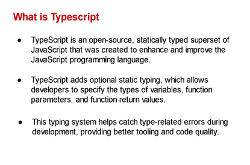
>
> * TypeScript es un superconjunto estadísticamente tipado y de código abierto de JavaScript creado para mejorar el
>lenguaje de programación JavaScript.<br/>
>TypeScript no es más que una envoltura construida sobre JavaScript, que tiene muchas más ventajas en comparación
>con JavaScript.
>
> * TypeScript añade tipado estático opcional, que permite a los desarrolladores especificar los tipos de variables,
>funciones, parámetros y valores de retorno de funciones.<br/>
>Este sistema de tipado ayuda a detectar errores relacionados con el tipo durante el desarrollo, proporcionando mejores herramientas
>y calidad de código.
>
> * La principal diferencia entre JavaScript y TypeScript es este sistema de tipado, donde podemos detectar los problemas
>relacionados con el tipo durante el tiempo de compilación, en lugar de durante el despliegue.
>
>**Ahora entenderemos la historia de TypeScript.**
>
>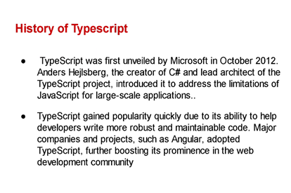
>
> * TypeScript fue presentado por primera vez por Microsoft en octubre de 2012 por Anders Hesselberg, creador de C-sharp y principal
>arquitecto del proyecto TypeScript.<br/>
>Introdúzcalo para hacer frente a las limitaciones de JavaScript para aplicaciones a gran escala.
>
> * TypeScript ganó popularidad muy rápidamente debido a su capacidad para ayudar a los desarrolladores a escribir código más robusto
>y mantenible.<br/>
>Grandes empresas y proyectos como angular adoptaron TypeScript, impulsando aún más su prominencia en la comunidad
>de desarrollo web.
>
>**Vamos a ver cuáles son las características de TypeScript.**
>
>")
>
> * La primera característica es la tipificación estática.
>   * TypeScript introduce la tipificación estática, permitiendo a los desarrolladores especificar los tipos de datos de las variables, parámetros
>de función y valores de retorno, lo que significa que siempre que estemos creando una variable, podemos mencionarlo específicamente.
>Por ejemplo, quería crear una variable de tipo número o de tipo cadena.
>   * Esto ayuda a detectar los errores relacionados con el tipo durante el tiempo de compilación.
>
>")
> * La siguiente característica es la inferencia de tipos.<br/>
>TypeScript a menudo puede inferir tipos sin anotaciones explícitas, reduciendo la necesidad de declaraciones de tipos
>repetitivas.
>
> * Lo siguiente es la interfaz y las clases.<br/>
>TypeScript admite conceptos de programación orientada a objetos como clases e interfaces, lo que permite al desarrollador
>crear un código bien
>
>")
>
> * La siguiente característica son los genéricos.<br/>
>TypeScript proporciona soporte para genéricos, permitiendo a las funciones y estructuras de datos trabajar con varios
>tipos de datos manteniendo la seguridad de tipos.
>
> * Y lo siguiente son los tipos de unión e intersección.<br/>
>TypeScript admite la unión, que consiste en combinar varios tipos, y la intersección de tipos, que consiste en combinar
>varios tipos en uno.<br/>
>Lo que quiere decir con esto es que, por ejemplo, si quisiera crear una variable que aceptara un número
>o una cadena, esto no es posible en otros lenguajes de programación, pero es muy posible en
>TypeScript.
>
>")
>
> * Y la siguiente característica es el acceso al ecosistema JavaScript.<br/>
>TypeScript es compatible con el código JavaScript existente, lo que permite a los desarrolladores adoptar TypeScript de forma
>incremental en sus proyectos.<br/>
>Esta es una de las principales características por las que TypeScript fue un gran éxito, porque todos los proyectos JavaScript existentes
>se pueden convertir en un proyecto TypeScript.<br/>
>La razón es porque TypeScript no es más que una envoltura de JavaScript.
>Y soporte avanzado de identificación.
>
> * TypeScript ofrece excelentes herramientas e integración con el popular entorno de desarrollo integrado,
>que se llama IDs.<br/>
>Las más populares, como Visual Studio Code, que ofrece herramientas inteligentes de compleción de código, comprobación
>de tipos e incluso refactorización.
>
>Ahora hemos entendido las características de TypeScript.
>
>**Ahora veremos en qué se diferencian TypeScript y JavaScript.**
>
>")
>
> * El primero es el sistema de tipos.
>
>   * TypeScript introduce un sistema de tipos estáticos que permite a los desarrolladores especificar los tipos de los parámetros de las funciones
>variables y los valores de retorno.
>
>   * Pero en JavaScript, JavaScript es un tipo dinámico, lo que significa que los tipos de datos se determinan en tiempo de ejecución.<br/>
>Así que cuando creas una variable en JavaScript, no necesitas mencionar el tipo, pero entenderá que hemos introducido una variable
>numérica o una variable de cadena durante el tiempo de ejecución.<br/>
>Las variables pueden cambiar su tipo de datos durante la ejecución, lo que puede provocar un comportamiento inesperado
>en JavaScript.
>JavaScript se basa en la comprobación en tiempo de ejecución, por lo que es más propenso a los errores relacionados con el tipo.
>
>Esta es una de las principales diferencias entre TypeScript y JavaScript.
>
>")
>
> * La siguiente es la compatibilidad.
>   * TypeScript está diseñado como un superconjunto de JavaScript, lo que significa que todo el código JavaScript válido es también
>código TypeScript válido.<br/>
>Esto facilita el incremento.
>Adopción de TypeScript en un proyecto JavaScript existente.
>
>   * Mientras que en JavaScript, JavaScript es un lenguaje omnipresente de la web y todos los navegadores web lo soportan de forma
>nativa, es el lenguaje por defecto para el desarrollo web y se puede utilizar sin ninguna configuración
>o compilación adicional.
>
>")
>
> * La siguiente diferencia importante es la compilación.
>   * El código TypeScript debe transpilarse o convertirse en código JavaScript antes de poder ejecutarse en un navegador
>o en un entorno NodeJS.<br/>
>Esto añade un paso más al proceso de desarrollo, pero garantiza la compatibilidad con el entorno JavaScript.<br/>
>Lo que significa es que si escribes un código TypeScript e intentas ejecutarlo, el entorno NodeJS no puede
>tomar directamente el código TypeScript y ejecutarlo.
>
>   * En su lugar, tenemos que convertir el código TypeScript existente en un código JavaScript, porque el NodeJS
>o los navegadores sólo entenderán el código JavaScript.<br/>
>Mientras que en JavaScript, el código JavaScript es ejecutado directamente por los navegadores o el NodeJS
>sin necesidad de compilación.
>Esto simplifica el proceso de implantación.
>
>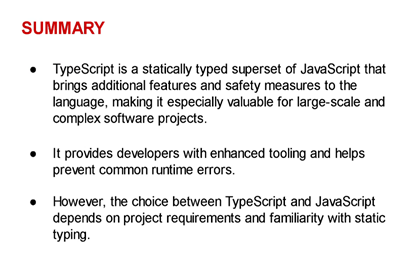
>
> * En resumen, TypeScript es un superconjunto estáticamente tipado de JavaScript que aporta características adicionales
>y medidas de seguridad al lenguaje, haciéndolo especialmente valioso para proyectos de software complejos y a
>gran escala.
>
> * Proporciona a los desarrolladores herramientas mejoradas y ayuda para evitar errores comunes en tiempo de ejecución.
>
> * Sin embargo, la elección entre TypeScript y JavaScript depende de los requisitos del proyecto y de la familiaridad
>con el tipado estático.
>
>Así que este es el TypeScript y las ventajas de utilizar TypeScript sobre JavaScript.
>


### 12. Prerequisite needed and Project Creation

1. El primer requisito es un IDE y se sugiere usar [`Visual Studio Code`](https://code.visualstudio.com/download)
2. El segundo es el Node.js, que tiene dos opciones:
    * Descargar de este sitio [`Node.js®`](https://nodejs.org/en/download) el instalador, <br/> o
    * Instalar con con [`nvm Windows`](https://github.com/coreybutler/nvm-windows/releases/download/1.2.2/nvm-setup.exe), o [`nvm MAC`](https://formulae.brew.sh/formula/nvm)<br/> siguiendo las instrucciones de [Instalar múltiples versiones de Node.js](https://rafaelneto.dev/blog/instalar-multiples-versiones-nodejs-windows/).

Prefiero la segunda opción.

3. Verificamos que versión tenemos de `Node.js` con este comando en una `TERMINAL` de `Visual Studio Code`: <br/> `node - v` <br/> En mi caso la respuesta es: <br/> `v22.18.0`
4. También verificamos el `npm` que versión tiene, con el comando: <br/> `npm -v` <br/> Y la respuesta es: <br/> `10.9.3`
5. Prefiero utilizar el [`pnpm`](https://pnpm.io/installation) o el [`yarn`](https://classic.yarnpkg.com/lang/en/docs/install/#windows-stable). <br/> Del primero ejecuto este comando: <br/> `pnpm -v` <br/> Y obtengo esta respuesta: <br/> `10.17.1` <br/> Esto en el MACBook Pro.
6. Hacemos una instalación global de `Typescript`, ejecutando en una `TERMINAL` el comando: <br/> `npm i -g typescript` <br/> Esta sería la respuesta: `added 1 package`
7. Otra dependencia a ejecutar en una `TERMINAL` sería: <br/> `npm install -g ts-node` <br/> Y esta es la respuesta: `added 20 packages`
8. Podemos inicializar el ambiente para `Typescript` con este comando en una `TERMINAL`: <br/> `tsc --init` <br/> y la respuesta es: <br/> `Created a new tsconfig.json` <br/> `You can learn more at https://aka.ms/tsconfig`
9. Este es el archivo **`tsconfig.json`**:
```json
{
  // Visit https://aka.ms/tsconfig to read more about this file
  "compilerOptions": {
    // File Layout
    // "rootDir": "./src",
    // "outDir": "./dist",

    // Environment Settings
    // See also https://aka.ms/tsconfig/module
    "module": "nodenext",
    "target": "esnext",
    "types": [],
    // For nodejs:
    // "lib": ["esnext"],
    // "types": ["node"],
    // and npm install -D @types/node

    // Other Outputs
    "sourceMap": true,
    "declaration": true,
    "declarationMap": true,

    // Stricter Typechecking Options
    "noUncheckedIndexedAccess": true,
    "exactOptionalPropertyTypes": true,

    // Style Options
    // "noImplicitReturns": true,
    // "noImplicitOverride": true,
    // "noUnusedLocals": true,
    // "noUnusedParameters": true,
    // "noFallthroughCasesInSwitch": true,
    // "noPropertyAccessFromIndexSignature": true,

    // Recommended Options
    "strict": true,
    "jsx": "react-jsx",
    "verbatimModuleSyntax": true,
    "isolatedModules": true,
    "noUncheckedSideEffectImports": true,
    "moduleDetection": "force",
    "skipLibCheck": true,
  }
}
```
10. La primera parte del archivo **`tsconfig.json`**, es `"compilerOptions":`, la primera es `"target"`, en mi caso aparece `"esnext"` y al instructor `"es2016"`.
11. El `"module":` en mi caso aparece `"nodenext"`, al instructor le aparece `"commonjs"`.
12. **"target":** <br/> Así que aquí el primero son los objetivos. <br/> Aquí se especifica la versión de script a la que se debe transpilar el código TypeScript. <br/> En este caso, se ha configurado para ES 2006, lo que significa que el código JavaScript generado será compatible con la versión Ecmascript 2016, que básicamente no es otra cosa que Es7.
13. **"module":** <br/> El siguiente es el módulo. <br/> Define el sistema de módulos que se utilizará al generar los módulos JavaScript. <br/> Y aquí el módulo al que se refiere es Commonjs, que es una opción popular para el entorno NodeJS.
14. **"esModuleInterop":** <br/> Cuando este valor está establecido en true, esta opción habilita el modo de compatibilidad para trabajar con módulos ES. <br/>Simplifica la interoperabilidad entre el código TypeScript y JavaScript.<br/> Se lo agregué que no lo tenía en las opciones.
15. **"forceConsistentCasingInFileNames":** <br/> La siguiente es para la coherencia entre mayúsculas y minúsculas en los nombres de archivo. <br/> Cuando este valor se establece en true, TypeScript impone el uso coherente de las mayúsculas y minúsculas en los nombres de archivo. <br/> Esto significa que el nombre de un archivo debe coincidir exactamente con las mayúsculas y minúsculas, lo que puede ayudar a evitar problemas en los sistemas de archivos que distinguen entre mayúsculas y minúsculas. <br/> Otro opción agregada.
16. **"strict":** <br/> El siguiente es estricto. <br/> Estricto cuando el valor se establece como verdadero. <br/> Activa la comprobación estricta de tipos y reglas adicionales relacionadas con tipos en TypeScript. <br/> Es una configuración recomendada para escribir código robusto y mantenible.
17. **"skipLibCheck":** <br/>Y la última es saltarse la comprobación de lib. <br/> Cuando este valor se establece en true, se salta la comprobación de tipo de los archivos de declaración, como los archivos que tenemos con extensión **`.tsx`** o  **`.ts`**.
18. Esto puede mejorar el rendimiento de la compilación, pero también puede suprimir posibles errores de tipo en el archivo de declaración.
19. Creamos el archivo **`012_helloWorld.ts`** con solo esta línea: <br/> `console.log("Hello World");`
20. Para ejecutarlo en una `TERMINAL` este comando: <br/> `tsc ./012_helloWorld` <br/> Y el la respuesta del proceso es que aparece el archivo **`012_helloWorld.js`**.
21. Ahora bien ya podemos ejectar con este comando en la `TERMINAL`: <br/> `node ./012_helloWorld` <br/> Y nos aparece el la respuesta esperada: <br/> `Hello World`
22. En este punto nos sugieren instalar en `Visual Studio Code`, la extensión [ `Code Runner`](https://marketplace.visualstudio.com/items?itemName=formulahendry.code-runner) de [Jun Han](https://marketplace.visualstudio.com/publishers/formulahendry).
23. Estando con el archivo abierto de **`012_helloWorld.ts`**, se presiona el triángulo en la parte superior ⏯️ o dando clic derecho sobre el archivo para la opción de `Run Code`, nos parece la respuesta abajo en `OUTPUT`.


### 13. Variables

1. Creamos el archivo **`013_variables.ts`**, con estas definiciones:
```js
var myName = "JuanPiza";
var myAge = 25;
const myGender = "Male";
```
2. Luego las muestro por pantalla:
```js
console.log(
	"My Name is " +
		myName +
		" and my age is " +
		myAge +
		" and I am a " +
		myGender,
);
```
3. Ejecuto y aparce esto en el `OUTPUT`: <br/> `My Name is JuanPiza and my age is 25 and I am a Male`


### 14. Data Types

1. Creamos el archivo **`014_dataTypes.ts`**, con  definiciones de _Boolean_:
```js
// Boolean
let isDone: boolean = true;
let isEnabled: boolean = false;

console.log(isDone, isEnabled);
```
2. Añado al archivo **`014_dataTypes.ts`**, mas  definiciones como _Number_:
```js
// Number
let num1: number = 25;
let num2: number = 99.99999;

console.log(num1, num2);
```
3. Añado al archivo **`014_dataTypes.ts`**, mas  definiciones  _String_:
```js
// String
let firstName: string = "Juan";
let lastName: string = "Piza";

console.log(firstName, lastName);
```
4. Añado al archivo **`014_dataTypes.ts`**, mas  definiciones  _Any_:
```js
// Any
// biome-ignore lint/suspicious/noExplicitAny: demonstrating let usage for tutorial
let dynamicValue: any = 42;
console.log(dynamicValue);
dynamicValue = "David";
console.log(dynamicValue);
```
5. Añado al archivo **`014_dataTypes.ts`**, mas  definiciones  _Null_ y _Undefined_:
```js
// Null and Undefined
let nullValue: null = null;
// biome-ignore lint/complexity/noUselessUndefinedInitialization: demonstrating let usage for tutorial
let undefiniedValue: undefined = undefined; //It's not necessary to initialize undefiniedValue to undefined.

console.log(nullValue, undefiniedValue);
```

### 15. Operators

1. Empezamos creando el archivo **`015_Operators.ts`**, y algunos _Arithmetic Operators_:
```js
// Arithmetic Operators
/** biome-ignore-all lint/style/useConst: demonstrating let usage for tutorial */
let a = 10;
let b = 3;
let sum = a + b; // 13
let difference = a - b; // 7
let product = a * b; // 30
let quotient = a / b; // 3.333...
let remainder = a % b; // 1
console.log(sum, difference, product, quotient, remainder);
```
2. Agregamos un _Comparison Operator_:
```js
// Comparison Operator
let x = 5;
let y = 10;

// biome-ignore lint/suspicious/noDoubleEquals: demonstrating let usage for tutorial
let isEqual = x == y; // false
let isStrictEqual = x === y; // false
// biome-ignore lint/suspicious/noDoubleEquals: demonstrating let usage for tutorial
let isNotEqual = x != y; // true
let isGreaterThan = x > y; // false
let isLessThan = x < y; // true
let isGreaterOrEqual = x >= y; // false
let isLessOrEqual = x <= y; // true
console.log(
	isEqual,
	isStrictEqual,
	isNotEqual,
	isGreaterThan,
	isLessThan,
	isGreaterOrEqual,
	isLessOrEqual,
);
```
3. Agregamos un _Logical Operator_:
```js
// Logical Operator
let isTrue = true;
let isFalse = false;

let andResult = isTrue && isFalse; // false
let orResult = isTrue || isFalse; // true
let notResult = !isTrue; // false
console.log(andResult, orResult, notResult);
```
4. Agregamos _Assignment Operator_:
```js
// Asignment Operator
let num = 5;
num += 3; // 5 + 3 = 8
num -= 2; // 8 - 2 = 6
num *= 4; // 6 * 4 =24
num /= 3; // 24/ 3 = 8
num %= 5; // 8 % 5 = 3
console.log(num);
```
5. Agregamos un _Ternary Operator_:
```js
// Ternary Operator
let age = 20;
let message = age >= 18 ? "Adult" : "Minor";
console.log(message);
```

### 16. Conditional statements

1. Empezamos creando el archivo **`016_conditionalStatements.ts`**.
2. Añadimo el condicional _if_:
```js
// If Statement
let myAgeNow = 15;
if (myAgeNow >= 18) {
	console.log("You are an adult");
}
```
3. Agrego un _Else If Statement_:
```js
// Else if Statement
let num = 0;
if (num > 0) {
	console.log("This is positive Number");
} else if (num < 0) {
	console.log("This is negative Number");
} else {
	console.log("This is zero");
}
```

### 17. Switch Statements

1. Empezamos creando el archivo **`017_switchStatetement.ts`**.
2. Ingresamos este código:
```js
let today = new Date().getDay(); // Get the current day of the week (0-6)
let dayName;

switch (today) {
  case 0:
    dayName = "Sunday";
    console.log("It's Sunday, time to relax!");
    break;
  case 1:
    dayName = "Monday";
    console.log("Happy Monday! Start of the work week.");
    break;
  case 2:
    dayName = "Tuesday";
    console.log("It's Tuesday. You got this!");
    break;
  case 3:
    dayName = "Wednesday";
    console.log("Hump day already!");
    break;
  case 4:
    dayName = "Thursday";
    console.log("Just one more day 'til the weekend!");
    break;
  case 5:
    dayName = "Friday";
    console.log("Happy Friday! The weekend is here!");
    break;
  case 6:
    dayName = "Saturday";
    console.log("Have a wonderful Saturday!");
    break;
  default:
    dayName = "Unknown Day";
    console.log("Something went wrong, unable to determine the day.");
}

console.log("Today is " + dayName + ".");
```

## Section 3: Typescript Advanced

### 18. Loops

1. Paso todos los archivos a la carpeta **"02_Typescript_Basics"**.
2. Creo la carpeta **"03_Typescript_Advanced"** y dentro pondremos todos los archivos de esta sección
3. Empezamos creando el archivo **`018_loops.ts`**.
4. Añadimos el ciclo _For Loop_:
```js
// For Loop
for (let i = 0; i < 5; i++) {
	console.log(i);
}
```
5. Agrego el _While Loop_:
```js
// While Loop
let count = 0;
while (count < 5) {
	console.log(count);
	count++;
}
```
6. Ponemos otro _Do While Loop_:
```js
// Do While Loop
let num = 0;
do {
	console.log(num);
	num++;
} while (num < 5);
```
7. Un _For Loop and break_:
```js
// For Loop and break
for (let i = 0; i < 10; i++) {
	if (i === 5) {
		break;
	}
	console.log(i);
}
```

### 19. Arrays

1. Empezamos creando el archivo **`03_Typescript_Advanced/019_arrays.ts`**.
2. Creamos un _Array Literal_:
```js
// Array Literal
const fruits: string[] = ["Apple", "Banana", "Orange"];
console.log(fruits); // Output: ["Apple", "Banana", "Orange"]
```
3. Añadimos otrro _Array Constructor_:
```js
// Array Constructor 1
const numbers: Array<number> = new Array(1, 2, 3, 4, 5);
console.log(numbers); // Output: [1, 2, 3, 4, 5]

// Array Constructor 2
const numbers2: number[] = new Array(1, 2, 3, 4, 5);
console.log(numbers2); // Output: [1, 2, 3, 4, 5]
```
4. Vamos por un _Inizialize an empty Array
```js
// Initializate an empty array
const emptyArray: string[] = [];
console.log(emptyArray); // Output: []
```
5. Accediendo a los elementos del arreglo:
```js
// Accessing array elements
console.log(fruits[0]); // Output: Apple
console.log(numbers[2]); // Output: 3
```
6. Adicionando elementos al arreglo:
```js
// Adding elements to an array
fruits.push("Mango");
console.log(fruits); // Output: ["Apple", "Banana", "Orange", "Mango"]
```
7. Borrando elementos de un arreglo:
```js
// Removing elements from an array
let lastFruit = fruits.pop();
console.log(lastFruit); // Output: Mango
console.log(fruits); // Output: ["Apple", "Banana", "Orange"]
```
8. Removiendo el primer elemento del arreglo:
```js
// Removing the first element from an array
let firstFruit = fruits.shift();
console.log(firstFruit); // Output: Apple
console.log(fruits); // Output: ["Banana", "Orange"]
```
9. Adicionando el primer elemento de un arreglo:
```js
// Adding elements to the beginning of an array
fruits.unshift("Strawberry");
console.log(fruits); // Output: ["Strawberry", "Banana", "Orange"]
```
10. Retorna una copia de una parte del arreglo:
```js
// Returns a copy of a section of an array. 
let citrus = fruits.slice(1, 3);
console.log(citrus); // Output: ["Banana", "Orange"]
```
11. Con _map()_ creamos la copia del arreglo pero afectando cada elemento de este:
```js
// map() method creates a new array populated with the results of calling a provided function on every element in the calling array.
let upperFruits = fruits.map(fruit => fruit.toUpperCase());
console.log(upperFruits); // Output: ["STRAWBERRY", "BANANA", "ORANGE"]
```
12. Con _filter()_ Se crea un nuevo arreglo con condiciones:
```js
// filter() method creates a new array with all elements that pass the test implemented by the provided function.
let longNamedFruits = fruits.filter(fruit => fruit.length > 5);
console.log(longNamedFruits); // Output: ["Strawberry", "Banana", "Orange"]
```
13. Un Arreglo de solo lectura:
```js
// Readonly arrays
const readOnlyFruits: ReadonlyArray<string> = ["Apple", "Banana", "Orange"];
console.log(readOnlyFruits); // Output: ["Apple", "Banana", "Orange"]
// readOnlyFruits.push("Mango"); // Error: Property 'push' does not exist on type 'readonly string[]'.
```

### 20. Tuples

1. Empezamos creando el archivo **`03_Typescript_Advanced/020_tuples.ts`**
2. Hacemos una definición y una inicialización:
```js
// Tuple type definition
let person: [string, number, boolean];

// Initializing a tuple
person = ["Alice", 30, true];
```
3. Mostramos los elementos:
```js
// Accessing tuple elements
console.log(person[0]); // Output: Alice
console.log(person[1]); // Output: 30
console.log(person[2]); // Output: true
```
4. Modificamos un elemento de la _Tuple_:
```js
// Modifying tuple elements
person[1] = 31; // Update age
console.log(person); // Output: ["Alice", 31, true]
```
5. Un _Tuple_ con elementos opcionales:
```js
// Tuple with optional elements
let employee: [string, number, string?];
employee = ["Bob", 101];
console.log(employee); // Output: ["Bob", 101]
```
6. Diferencias entre _Tuple_ y _Array_:
    * La primera diferencia clave es la coherencia tipográfica. <br/>Las tuplas tienen una longitud fija y cada elemento tiene un tipo específico, por lo que imponen una estructura coherente. <br/> Mientras que en las matrices, las matrices pueden tener una longitud variable y básicamente almacenan los elementos del mismo tipo,pero también pueden almacenar en el tipo mixto.
    * La siguiente es la seguridad de los tipos. <br/>Las tuplas proporcionan una fuerte seguridad de tipos ya que TypeScript comprueba los tipos de los elementos en tiempo de compilación, mientras que las matrices son menos estrictas en términos de seguridad de tipos ya que permitirán tipos mixtos y el cese dinámico del siguiente.
    * Inmutabilidad. <br/>Las tuplas son inmutables en cuanto a su longitud y elementos. <br/>tipos después de la declaración, lo que significa que una vez que declaramos un tipo en a en una tupla, no nos permitirá cambiar después de eso. <br/>Mientras que en las matrices. Las matrices son mutables, por lo que se pueden redimensionar y modificar libremente. <br/>Lo que significa que aunque declaremos un array más adelante en el código, nos permitirá incluso cambiar los <br/> valores dentro del array, o incluso borrar un array entero, algo así, pero que no es posible en tuple.
    * Y la última es Casos prácticos.<br/> Las tuplas se utilizan a menudo cuando se trata de datos que tienen una estructura fija específica, como la representación de coordenadas o pares de valores relacionados o tipos de retorno de funciones. <br/> Mientras que las matrices son más versátiles y se utilizan para colecciones de datos en las que los elementos pueden variar <br/>en tipo y número en el resumen.
    * Las tuplas en TypeScript son una poderosa característica para trabajar con datos estructurados, proporcionando tipo, seguridad y longitud fija, mientras que las matrices no tienen tanta seguridad de tipo, pero nos permitirá jugar libremente con ellas, como cambiar los valores y todo eso.


### 21. Objects

1. Empezamos creando el archivo **`03_Typescript_Advanced/021_objects.ts`**.
2. Definición simple de un objeto:
```js
const person= 
{
	name: "Maximilian",
	age: 30,
	hobbies: ["Sports", "Cooking"],
	role: [2, "author"],
};

console.log(person);
```
3. Definicón del Objeto de forma mas apropiada:
```js
const person2: {
	name: string;
	age: number;
	hobbies: string[];
	role: [number, string];
} = {
	name: "Manu",
	age: 30,
	hobbies: ["Sports", "Cooking"],
	role: [2, "author"],
};

console.log(person2);
```
4. Mezclar objetos:
```js
const contactInfo: {
	email: string;
	phone: number;
} = {
	email: "kljslak@mail.com",
	phone: 1234567890,
};

console.log(contactInfo);

// Merged Object
const mergedPerson = { ...person, ...contactInfo };
console.log("merged:", mergedPerson);
```
5. Definición de _Type_ y de _Alias_:
```js
// Type Aliases
type Person = {
	name: string;
	age: number;
	hobbies: string[];
	role: [number, string];
};

const person3: Person = {
	name: "Anna",
	age: 25,
	hobbies: ["Dancing", "Singing"],
	role: [1, "admin"],
};

console.log(person3);
```


### 22. Functions

1. Empezamos con el archivo **`022_function.ts`**.
2. Estas funciones básicas:
```js
function hi() {
	console.log("Hello, I'm a function");
}

hi();

function calculateTotal(price: number, quantity: number): number {
	return price * quantity;
}
console.log(calculateTotal(5, 3));

function greet(name:string, greetMessage:string='Hi'):string{
  return (`${greetMessage} ${name}`);
}
console.log(greet('Juan'));
console.log(greet('Juan', 'Good morning'));
```
3. Estas funciones tipo _arrow_ o flecha:
```js
// Arrow Functions
const multiply = (f1: number, f2: number): number => {
	return f1 * f2;
};
console.log(multiply(6, 18));
```
4. Creo un _type_ para asignarselo a una _const_ y usarla como una función:
```js
type MathOperation = (a: number, b: number) => number;
const add: MathOperation = (n1, n2) =>{ return(n1 + n2)};
console.log(add (6,7));
```

### 23. Scope

1. Empezamos con el archivo **`023_scope.ts`**.
2. Esto sería una variable o constante de uso global:
```js
// Global Scope
const globalVar = 10;

function anyName() {
	console.log(globalVar);
}
anyName();
```
3. Esto una de uso local:
```js
// Local Scope
function another() {
	const localVar = 20;
	console.log(localVar);
}
another();
```
4. El alcance solo en un bloque de código:
```js
// Block Scope
if (true) {
	const blockVar = 30;
	console.log(blockVar);
}
```


## Section 4: Playwright Installation and Project Setup


### 24. Prerequisites Needed before Installing Playwright

1. El primer requisito es un IDE y se sugiere usar [`Visual Studio Code`](https://code.visualstudio.com/download)
2. El segundo es el Node.js, que tiene dos opciones:
    * Descargar de este sitio [`Node.js®`](https://nodejs.org/en/download) el instalador, <br/> o
    * Instalar con con [`nvm Windows`](https://github.com/coreybutler/nvm-windows/releases/download/1.2.2/nvm-setup.exe), o [`nvm MAC`](https://formulae.brew.sh/formula/nvm)<br/> siguiendo las instrucciones de [Instalar múltiples versiones de Node.js](https://rafaelneto.dev/blog/instalar-multiples-versiones-nodejs-windows/).

Prefiero la segunda opción.

3. Verificamos que versión tenemos de `Node.js` con este comando en una `TERMINAL` de `Visual Studio Code`: <br/> `node - v` <br/> En mi caso la respuesta es: <br/> `v22.18.0`
4. También verificamos el `npm` que versión tiene, con el comando: <br/> `npm -v` <br/> Y la respuesta es: <br/> `10.9.3`
5. Prefiero utilizar el [`pnpm`](https://pnpm.io/installation) o el [`yarn`](https://classic.yarnpkg.com/lang/en/docs/install/#windows-stable). <br/> Del primero ejecuto este comando: <br/> `pnpm -v` <br/> Y obtengo esta respuesta: <br/> `10.17.1` <br/> Esto en el MACBook Pro. <br/> El segundo ejecuto esto: <br/> `yarn -v` <br/> Y la respuesta es: <br/> `1.22.22` <br/> En Octubre de 2025.


### 25. Important Note: Playwright Version Update

>[!NOTE]
>
>**Important Note: Playwright Version Update**
>
>In the upcoming video, we will be installing Playwright Version `1.51.0`
>
>But the current month's latest Playwright version is `1.55`
>
>Do not worry. All the videos in the course work with the latest Playwright Version `1.55`
>
>HAPPY LEARNING !!!


### 26. Installation of Playwright - Way 1

1. Basado en este sitio [**Installing Playwright**](https://playwright.dev/docs/intro#installing-playwright), lo voy a hacer con `yarn`, en una `TERMINAL` de `Visual Studio Code`: <br/> `yarn create playwright`.
2. El Empieza diferente al Instructor a el le sale: <br/> `Do you want to use TypeScript or Javascript` <br/> El de `yard` empieza con: <br/> `Where to put your end-to-end tests?` <br/> Para responder el valor por defecto: `test`.
3. En la siguiente opción: <br/> `Add a GitHub Actions workflow?` <br/> Lo dejo en el por defecto: `true`.
4. La tercera pregunta: <br/> `Install Playwright browsers (can be done manually via 'yarn playwright install')?` <br/> La dejo por defecto: `true`.
5. Este es el proceso generado:
```dos
Initializing Yarn project (yarn init -y)…
yarn init v1.22.22
warning The yes flag has been set. This will automatically answer yes to all questions, which may have security implications.
success Saved package.json
✨  Done in 0.07s.
Installing Playwright Test (yarn add --dev @playwright/test)…
yarn add v1.22.22
info No lockfile found.
[1/4] 🔍  Resolving packages...
[2/4] 🚚  Fetching packages...
[3/4] 🔗  Linking dependencies...
[4/4] 🔨  Building fresh packages...
success Saved lockfile.
success Saved 4 new dependencies.
info Direct dependencies
└─ @playwright/test@1.56.0
info All dependencies
├─ @playwright/test@1.56.0
├─ fsevents@2.3.2
├─ playwright-core@1.56.0
└─ playwright@1.56.0
✨  Done in 4.81s.
Installing Types (yarn add --dev @types/node)…
yarn add v1.22.22
[1/4] 🔍  Resolving packages...
[2/4] 🚚  Fetching packages...
[3/4] 🔗  Linking dependencies...
[4/4] 🔨  Building fresh packages...
success Saved lockfile.
success Saved 2 new dependencies.
info Direct dependencies
└─ @types/node@24.7.0
info All dependencies
├─ @types/node@24.7.0
└─ undici-types@7.14.0
✨  Done in 2.50s.
Writing playwright.config.ts.
Writing .github/workflows/playwright.yml.
Writing tests/example.spec.ts.
Writing package.json.
Downloading browsers (yarn playwright install)…
yarn run v1.22.22
$ $HOME/Development/tutorials/nodejs/Playwright-1.55-Docker-Cucumber-Jenkins-SEP25/node_modules/.bin/playwright install
Downloading Chromium 141.0.7390.37 (playwright build v1194) from https://cdn.playwright.dev/dbazure/download/playwright/builds/chromium/1194/chromium-mac-arm64.zip
129.7 MiB [====================] 100% 0.0s
Chromium 141.0.7390.37 (playwright build v1194) downloaded to $HOME/Library/Caches/ms-playwright/chromium-1194
Downloading Chromium Headless Shell 141.0.7390.37 (playwright build v1194) from https://cdn.playwright.dev/dbazure/download/playwright/builds/chromium/1194/chromium-headless-shell-mac-arm64.zip
81.7 MiB [====================] 100% 0.0s
Chromium Headless Shell 141.0.7390.37 (playwright build v1194) downloaded to $HOME/Library/Caches/ms-playwright/chromium_headless_shell-1194
Downloading Firefox 142.0.1 (playwright build v1495) from https://cdn.playwright.dev/dbazure/download/playwright/builds/firefox/1495/firefox-mac-arm64.zip
89.9 MiB [====================] 100% 0.0s
Firefox 142.0.1 (playwright build v1495) downloaded to $HOME/Library/Caches/ms-playwright/firefox-1495
Downloading Webkit 26.0 (playwright build v2215) from https://cdn.playwright.dev/dbazure/download/playwright/builds/webkit/2215/webkit-mac-15-arm64.zip
70.8 MiB [====================] 100% 0.0s
Webkit 26.0 (playwright build v2215) downloaded to $HOME/Library/Caches/ms-playwright/webkit-2215
Downloading FFMPEG playwright build v1011 from https://cdn.playwright.dev/dbazure/download/playwright/builds/ffmpeg/1011/ffmpeg-mac-arm64.zip
1 MiB [====================] 100% 0.0s
FFMPEG playwright build v1011 downloaded to $HOME/Library/Caches/ms-playwright/ffmpeg-1011
✨  Done in 51.69s.
✔ Success! Created a Playwright Test project at $HOME/Development/tutorials/nodejs/Playwright-1.55-Docker-Cucumber-Jenkins-SEP25

Inside that directory, you can run several commands:

  yarn playwright test
    Runs the end-to-end tests.

  yarn playwright test --ui
    Starts the interactive UI mode.

  yarn playwright test --project=chromium
    Runs the tests only on Desktop Chrome.

  yarn playwright test example
    Runs the tests in a specific file.

  yarn playwright test --debug
    Runs the tests in debug mode.

  yarn playwright codegen
    Auto generate tests with Codegen.

We suggest that you begin by typing:

    yarn playwright test

And check out the following files:
  - ./tests/example.spec.ts - Example end-to-end test
  - ./playwright.config.ts - Playwright Test configuration

Visit https://playwright.dev/docs/intro for more information. ✨

Happy hacking! 🎭
✨  Done in 15569.57s.
```
6. Obtengo el archivo **`package.json`**, con esta información:
```json
{
  "name": "Playwright-1.55-Docker-Cucumber-Jenkins-SEP25",
  "version": "1.0.0",
  "main": "index.js",
  "repository": "https://github.com/JDGonzal/Playwright-1.55-Docker-Cucumber-Jenkins-SEP25.git",
  "author": "Juan David Gonzalez Piza <jdgonzal2@gmail.com>",
  "license": "MIT",
  "devDependencies": {
    "@playwright/test": "^1.56.0",
    "@types/node": "^24.7.0"
  },
  "scripts": {}
}
```
7. El único cambio a realizar es quitar lo _carets_ o este símbolo `^` de las dependencias.
8. Debo de agregar el campo `"type":` con el valor de `"module"`.
9. Adicional tengo la carpeta **"tests"**, con el archivo **`tests/example.spec.ts`** y este contenido:
```js
import { test, expect } from '@playwright/test';

test('has title', async ({ page }) => {
  await page.goto('https://playwright.dev/');

  // Expect a title "to contain" a substring.
  await expect(page).toHaveTitle(/Playwright/);
});

test('get started link', async ({ page }) => {
  await page.goto('https://playwright.dev/');

  // Click the get started link.
  await page.getByRole('link', { name: 'Get started' }).click();

  // Expects page to have a heading with the name of Installation.
  await expect(page.getByRole('heading', { name: 'Installation' })).toBeVisible();
});
```
10. Otro archivo nuevo es **`.github/workflows/playwright.yml`**, con este código:
```yml
name: Playwright Tests
on:
  push:
    branches: [ main, master ]
  pull_request:
    branches: [ main, master ]
jobs:
  test:
    timeout-minutes: 60
    runs-on: ubuntu-latest
    steps:
    - uses: actions/checkout@v4
    - uses: actions/setup-node@v4
      with:
        node-version: lts/*
    - name: Install dependencies
      run: npm install -g yarn && yarn
    - name: Install Playwright Browsers
      run: yarn playwright install --with-deps
    - name: Run Playwright tests
      run: yarn playwright test
    - uses: actions/upload-artifact@v4
      if: ${{ !cancelled() }}
      with:
        name: playwright-report
        path: playwright-report/
        retention-days: 30
```
11. Otro archivo es **`playwright.config.ts`**, con esta información:
```js
import { defineConfig, devices } from '@playwright/test';

/**
 * Read environment variables from file.
 * https://github.com/motdotla/dotenv
 */
// import dotenv from 'dotenv';
// import path from 'path';
// dotenv.config({ path: path.resolve(__dirname, '.env') });

/**
 * See https://playwright.dev/docs/test-configuration.
 */
export default defineConfig({
  testDir: './tests',
  /* Run tests in files in parallel */
  fullyParallel: true,
  /* Fail the build on CI if you accidentally left test.only in the source code. */
  forbidOnly: !!process.env.CI,
  /* Retry on CI only */
  retries: process.env.CI ? 2 : 0,
  /* Opt out of parallel tests on CI. */
  ...(process.env.CI ? { workers: 1 } : {}),
  /* Reporter to use. See https://playwright.dev/docs/test-reporters */
  reporter: 'html',
  /* Shared settings for all the projects below. See https://playwright.dev/docs/api/class-testoptions. */
  use: {
    /* Base URL to use in actions like `await page.goto('')`. */
    // baseURL: 'http://localhost:3000',

    /* Collect trace when retrying the failed test. See https://playwright.dev/docs/trace-viewer */
    trace: 'on-first-retry',
  },

  /* Configure projects for major browsers */
  projects: [
    {
      name: 'chromium',
      use: { ...devices['Desktop Chrome'] },
    },

    {
      name: 'firefox',
      use: { ...devices['Desktop Firefox'] },
    },

    {
      name: 'webkit',
      use: { ...devices['Desktop Safari'] },
    },

    /* Test against mobile viewports. */
    // {
    //   name: 'Mobile Chrome',
    //   use: { ...devices['Pixel 5'] },
    // },
    // {
    //   name: 'Mobile Safari',
    //   use: { ...devices['iPhone 12'] },
    // },

    /* Test against branded browsers. */
    // {
    //   name: 'Microsoft Edge',
    //   use: { ...devices['Desktop Edge'], channel: 'msedge' },
    // },
    // {
    //   name: 'Google Chrome',
    //   use: { ...devices['Desktop Chrome'], channel: 'chrome' },
    // },
  ],

  /* Run your local dev server before starting the tests */
  // webServer: {
  //   command: 'npm run start',
  //   url: 'http://localhost:3000',
  //   reuseExistingServer: !process.env.CI,
  // },
});
```
12. Adicional debo hacer unas correcciones en el archivo **`tsconfig.json`**:
```js
{
  // Visit https://aka.ms/tsconfig to read more about this file
  "compilerOptions": {
    ...
    "module": "nodenext",
    "target": "esnext",
    "types": ["node"],

    ...
  }
}
```
13. Ejecutamos este comando en la `TERMINAL`, para verificar que todo este funcionando correctamente: <br/> `npx playwright test` <br/> y nos muestra esto:
```dos
Running 6 tests using 6 workers
  6 passed (13.1s)

To open last HTML report run:

  npx playwright show-report
```
14. Ejecutamos el comando que nos sugiere: <br/> `npx playwright show-report`<br/> Y nos parece una pantalla en el _browser_ como esta: <br/> 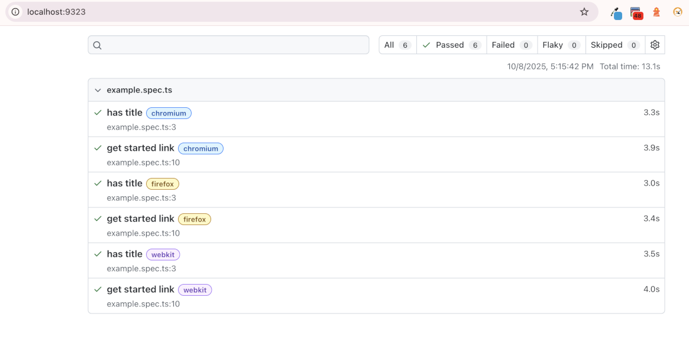


>[!NOTE]
>
>Hubo un proceso que se corrió en el repositorio de `Github`.
>
>Validación de un test de `Playwright`, arrojando este resultado: <br/> [](images/2025-10-08_175435.pdf)
>


### 27. Installation of Playwright - Way 2


1. En esta opción usaremos una extensión de `Visual Studio Code` de nombre [Playwright Test for VSCode](https://marketplace.visualstudio.com/items?itemName=ms-playwright.playwright) de  [Microsoft](https://marketplace.visualstudio.com/publishers/Microsoft)
2. Presionas las teclas [`Shift`]+[`Ctrl`]+[`P`] o en _MAC_ serían [`Shift`]+[`Command`]+[`P`], y escribe: <br/> `Test: Install Play`y escoje el primero.
3. Nos pregunta como lo vamos a ejecutar, y dejamos los valores por defecto: <br/> 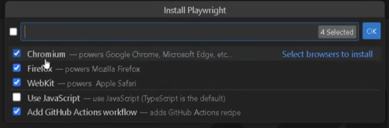
4. Hace un proceso similar al anterior [26. Installation of Playwright - Way 1](#26-installation-of-playwright---way-1), desde el paso 5, pero utilizando por defecto `npm`, en vez de uno seleccionado por el usuario como `pnpm` o `yarn`.
5. Se hacen los ajustes necesarios antes de que en una `TERMINAL`, se ejecute ese comando: <br/> `npx playwright test` <br/>


## Section 5: Writing First Playwright test


### 28. How to write a Sample test in Playwright

1. Empezamos borrando el archivo **`tests/example.spec.ts`**.
2. Luego borramos la carpeta **"test-examples"**, si existe.
3. Creamos el archivo **`tests/028_firstTest.spec.ts`**.
4. Empezamos con la importación de `{ test, expect }` de `"@playwright/test"`.
5. Llamamos la función `test()`, con los siguiente parámetros:
```js
test("My first Playwright test", async ({ page }) => {
	await page.goto("https://playwright.dev/");
	const title = page.locator(".navbar__inner .navbar__title");
	await expect(title).toHaveText("Playwright");
});
```
6. Lo puedo ejecutar del <span style="color:green"> (▶️) triángulo verde</span> que aparece en la izquierda del código o en una `TERMINAL` ejecutando el comando: <br/> `npx playwright test`
7. Al archivo **`playwright.config.ts`**, le anexo estos cambios, justo encima de `trace: 'on-first-retry'`:
```js
    headless: true,
    screenshot: 'only-on-failure',
    video: 'retain-on-failure',
    viewport: { width: 1280, height: 720 },
    trace: 'on-first-retry',    
```


### 29. Different ways to execute Test in Command Line

1. El primero que ya se ha ejecutado en la `TERMINAL` es: <br/> `npx playwright test` <br/> Ejecuta todo lo que hay en la carpeta **"tests"**.
2. Este otro comando: <br/> `npx playwright test --workers 3` <br/> Significa aquí tres sesiones individuales. <br/> Así que ahora si hago click en enter deberíamos ver que ejecutará todas las pruebas usando tres workers en modo paralelo, <br/> lo que significa que ejecutará el _Firefox_, _WebKit_ y _Chromium_ en modo paralelo.
3. Si al comnado anterior le agrego mas parámetros Lo que hará este comando es ejecutar todas las pruebas mencionadas en la carpeta de pruebas.<br/> Pero aquí asignará tres trabajadores y todos los trabajadores funcionarán en paralelo. Trabajadores significa aquí tres sesiones individuales:
```dos
npx playwright test --workers 3
```
4. Así que ahora si hago click en enter deberíamos ver que ejecutará todas las pruebas usando tres workers en modo paralelo, lo que significa que ejecutará el Firefox, WebKit y chromium en modo paralelo. <br/> La prueba se ejecutó, pero no podemos ver la invocación del navegador porque se ejecutó en modo _headless_:
<div style="font-family: 'Courier New', 'Lucida Console', monospace;">
<p>Running 3 tests using 3 workers<br/>
<span style="color:lightgreen;margin:10px;">3 passed</span>(20.2s)</p>
<p>To open last HTML report run:</p>
<p><span style="color:lightblue;">  npx playwright show-report</span</p>
</div>

5. El siguiente comando, que vas a ver es cómo ejecutar una prueba específica. </br> En nuestro caso, sólo tenemos un archivo de especificaciones:
```dos
npx playwright test tests/028_firstTest.spec.ts
```
6. Creamos una copia del archivo **`tests/028_firstTest.spec.ts`** y le ponemos los nombres de **`029_secondTest.spec.ts`** y **`029_thirdTest.spec.ts`**.
7. El siguiente comando que vas a ejecutar es para ejecutar múltiples archivos spec de una sola vez:
```dos
npx playwright test 028_firstTest.spec.ts 029_secondTest.spec.ts
```
8. Así que en total se están ejecutando seis pruebas porque por cada archivo de prueba se ejecutarán tres pruebas, es decir, se ejecutarán contra tres navegadores. </br>Así que tres más tres totalmente seises. </br> E ignoró el tercer archivo de prueba.:
<div style="font-family: 'Courier New', 'Lucida Console', monospace;">
<p>Running 6 tests using 6 workers<br/>
<span style="color:lightgreen;margin:10px;">6 passed</span>(10.7s)</p>
<p>To open last HTML report run:</p>
<p><span style="color:lightblue;">  npx playwright show-report</span</p>
</div>

9. El siguiente comando que va a ejecutar es en lugar de pasar el nombre completo, podemos pasar sólo el nombre de ejemplo de eso. </br> Por ejemplo, en lugar de pasar la primera prueba de sospechosos, si sólo podemos pasar la primera prueba y la segunda prueba, todavía lo recogerá.</br>Así que lo que voy a hacer aquí es que voy a editar el comando anterior:
```dos
npx playwright test firstTest secondTest
```
10. Así que aquí pide el subconjunto de este nombre. </br> Ahora, si hago clic en entrar todavía se puede ver que se iniciará la ejecución y se ejecutará de la misma manera como se ejecutó antes. </br>Así que esperemos a que se complete la ejecución. </br> Así que ha ejecutado tanto el primer aspecto como el segundo. </br>Así que está agarrando el nombre de esto, y lo está comparando con los archivos que están allí bajo la carpeta de prueba.</br>Así se completa la ejecución.</br>Así que ahora todo lo que hemos visto hasta ahora está relacionado con el nombre de este archivo de especificaciones.</br>Pero también podemos ejecutar la prueba pasando el nombre que se menciona en esta función de prueba.Así que tenemos tres pruebas:
<div style="font-family: 'Courier New', 'Lucida Console', monospace;">
<p>Running 6 tests using 6 workers<br/>
<span style="color:lightgreen;margin:10px;">6 passed</span>(3.9s)</p>
<p>To open last HTML report run:</p>
<p><span style="color:lightblue;">  npx playwright show-report</span</p>
</div>

11. Lo que podemos hacer es escribir el comando Npx playwright. </br>Prueba de espacio y tenemos que pasar un argumento que se llama guión.</br>Por lo tanto, el guión se refiere al nombre de la prueba y no al nombre del archivo.</br>Así que en nuestro caso estamos interesados en ejecutar esta mi segunda prueba:
```dos
npx playwright test -g "My second Playwright test"
```
12. Así que usted verá que se ejecutará sólo esta prueba y no cualquier otra prueba. </br>Así que puedes ver que está ejecutando la segunda prueba y está ejecutando sólo esta prueba.</br>Así es como podemos pasar el nombre de la prueba en lugar del nombre del archivo:
<div style="font-family: 'Courier New', 'Lucida Console', monospace;">
<p>Running 3 tests using 3 workers<br/>
<span style="color:lightgreen;margin:10px;">3 passed</span>(4.4s)</p>
<p>To open last HTML report run:</p>
<p><span style="color:lightblue;">  npx playwright show-report</span</p>
</div>

13. El siguiente comando que vas a aprender es como.</br>Por el momento, todas las pruebas se están ejecutando en los tres navegadores: _Chrome_, _Firefox_ y _WebKit_.</br>Digamos que estoy interesado en ejecutar sólo en el navegador _chromium_, porque mi proyecto exige probar sólo en _chromium_.</br>Así que en ese caso, lo que podemos hacer es simplemente pasar la prueba Npx playwright seguido de slash slash project igual a _chromium_:
```dos
npx playwright test --project=chromium
```
14. Así que está ejecutando todas las pruebas, una en el navegador chromium y no en ningún otro navegador.</br>Puede ver que la prueba ha sido superada si abro el informe ejecutando este comando, que es Npx playwright:
<div style="font-family: 'Courier New', 'Lucida Console', monospace;">
<p>Running 3 tests using 3 workers<br/>
<span style="color:lightgreen;margin:10px;">3 passed</span>(3.9s)</p>
<p>To open last HTML report run:</p>
<p><span style="color:lightblue;">  npx playwright show-report</span</p>
</div>

15. Puede ver que la prueba ha sido superada si abro el informe ejecutando este comando, que es Npx playwright show report.</br>Se puede ver que invocó a los tres archivos de especificaciones de prueba.</br>Pero un día con los navegadores de cromo:</br>`npx playwright show-report` </br>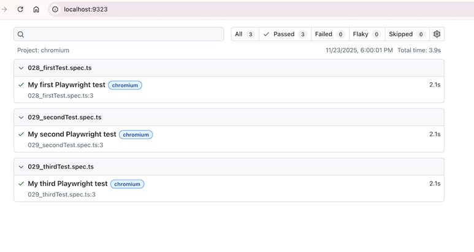


16. Si da click en alguno de las descripciones de las pruebas, lo lleva a otra página con el detalle de esa prueba.
17. Modificamos el archivo **`playwright.config.ts`** y cambiamos `headless: true,` por este `headless: false,` o escribir este comando:
```dos
npx playwright test --headed
```
18. Ejecuta las pruebas y muestras las ejecuciones en pantalla, y este es el resultado final:
<div style="font-family: 'Courier New', 'Lucida Console', monospace;">
<p>Running 9 tests using 6 workers<br/>
<span style="color:lightgreen;margin:10px;">9 passed</span>(8.3s)</p>
<p>To open last HTML report run:</p>
<p><span style="color:lightblue;">  npx playwright show-report</span</p>
</div>

19. El último comando que vamos a aprender es a ejecutar la prueba en modo depuración. </br>Así que lo que estoy diciendo es, por ejemplo, digamos que quería ejecutar esta prueba en cromo, por ejemplo.</br>Pero quería ejecutarlo en modo depuración.</br>Así que la razón para el modo de depuración es digamos que estamos teniendo algún problema en nuestra prueba, y queríamos depurarlo para encontrar qué línea falla. </br>Este comando de depuración nos ayudará:
```dos
npx playwright test --project=chromium --debug
```


## Section 6: Automatic Code Generation

### 30. How to enabled automatic Code Generation

>[!NOTE]
>
>Esta es una de las principales características de `playwright`, que nos ayudará a escribir fácilmente la prueba.<br/>
>Esta característica ayuda mucho a los principiantes que acaban de empezar a aprender codificación y automatización.<br/>
>El uso de Codegen es.
>Como su nombre indica, esta herramienta generará el código de `playwright` por nosotros basándose en la acción que realicemos navegador.

1. Para abrir el codegen se escribe en la `TERMINAL` el comando:
```bash
npx playwright codegen
```
2. Puedes ver que abre dos ventanas. Uno es el navegador _chromium_ y el otro es el  `Playwright Inspector`.<br/> También podemos cambiar el navegador, que veremos más adelante.<br/>Así que aquí se puede ver que ha abierto el navegador _chromium_ y también el `Playwright Inspector`.Guardo ambos uno al lado del otro para que puedas verlo con claridad.<br/> Así que ahora usted puede ver por defecto se inició la grabación, lo que significa que cualquiera que sean las acciones que estamos haciendo en este navegador, que lo grabará y se convertirá automáticamente en el guión `Playwright`.<br/>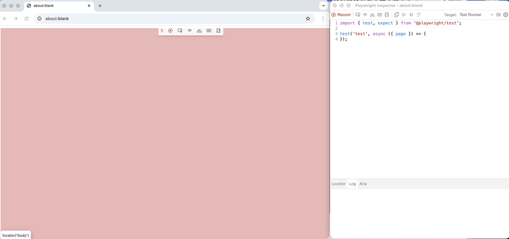


3. Pego esta _URL_ en el _Chromium_: <br/> `https://opensource-demo.orangehrmlive.com/web/index.php/auth/login` <br/> y graba automáticamente la ruta o _URL_ que empieza el proceso: <br/> ")


4. Doy clic en el cuadro de `Username` y le escribo `Admin`.
5. Doy clic en el cuadro de `Password` y le escribo `admin123`.
6. Doy clic al botón de `[Login]`. <br/> El ingresa al nuevo sitio después de aceptar el login correcto. <br/> 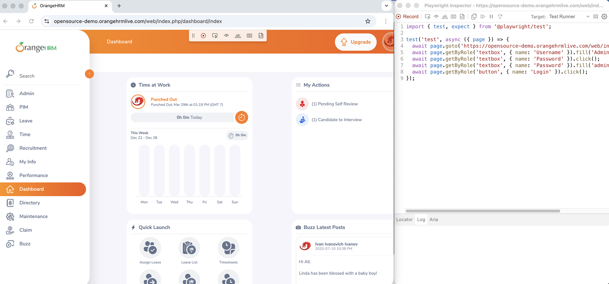


7. Vamos a darle clic en el botón a la derecha-arriba, con algo del texto `profile` y esto despliega un menú.
8. Del menú seleccionamos `Logout` y le damos clic.
9. Creamos un archivo de nombre **`tests/030_codeGentest.spec.ts`** , copiamos lo obtenido en el `Playwright Inspector` y lo pegamos en este nuevo archivo.
10. Adiciono esta línea al final del archivo, para que se tenga al menos un `expect`:
```js
	await expect(
		page.getByRole("img", { name: "company-branding" }),
	).toBeVisible();
```
11. Detengo la ejecución de `npx playwright codegen`.
12. Lo puedo ejecutar desde el <span style="color:green">(▶️) triángulo verde</span> que aparece en el código o en la terminal con el comando:
```bash
npx playwright test 030_codeGentest.spec.ts --project=chromium --headed
```
13. Aparece este texto al final y brinda la posibilidad de ejecutar otro comando:
```bash
Running 1 test using 1 worker
  1 passed (8.0s)

To open last HTML report run:

  npx playwright show-report
```


### 31. What are the Various options in CodeGen


1. En primer lugar, veamos cómo abrir Codegen en diferentes navegadores. </br> Como ya hemos mencionado, por defecto el Codegen se abre en el navegador Chromium, pero también podemos utilizar el Codegen en el navegador Firefox o WebKit. </br>El comando para abrir el Codegen en otro navegador es:</br> `npx playwright codegen --browser firefox`


2. En la ventana del browser de FireFox, ponemos la ruta de `google`: </br> Pero obtengo un error: </br> 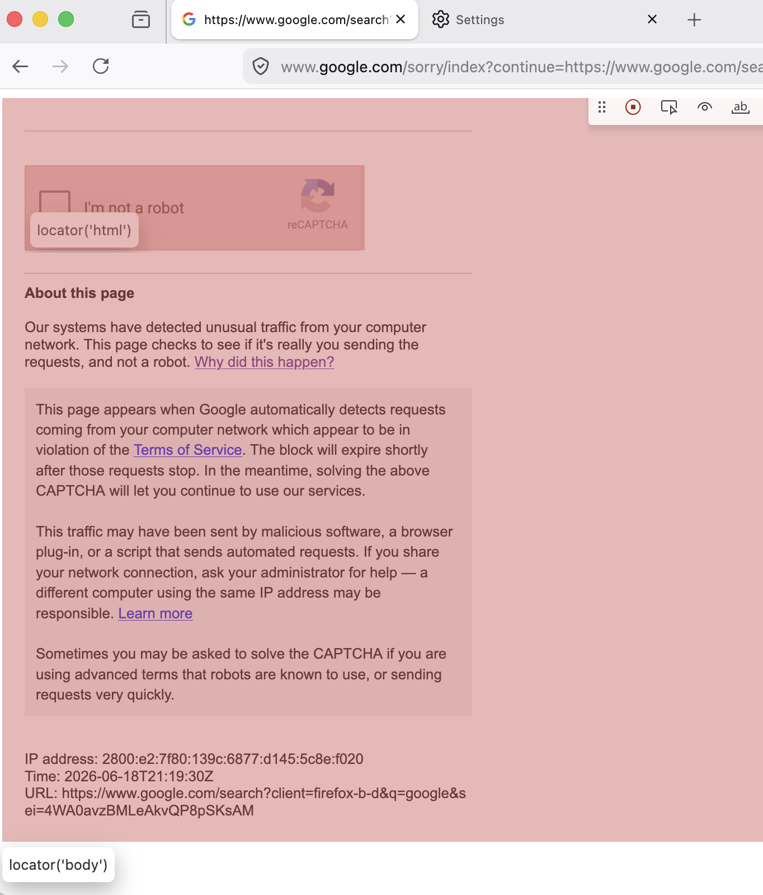


3. La solución planteada es crear en el proyecto la carpeta **"user_data"**
4. Y usar este comando completo apuntando a la nueva carpeta: </br> `npx playwright codegen --browser firefox --user-data-dir ./user_data`
5. Escrivo en la _URL_ `google`
6. Resulvo el _CAPTCHA_.
7. Doy `[Ctrl]`+`[C]` en la `TERMINAL`, para finalizar el proceso.
8. Ejecuto de nuevo el comandio del paso 4.
9. Vuelvo a escribir en la _URL_ `google` y listo, ya no pide mas el _CAPTCHA_.
10. Doy `[Ctrl]`+`[C]` en la `TERMINAL`, para finalizar el proceso.
11. Repetimos el proceso usando _webkit_: </br> `npx playwright codegen --browser webkit --user-data-dir ./user_data` </br>`npx playwright codegen --browser webkit`
12. Aunque este no es tan fácil de interactuar para el proceso.
13. Doy `[Ctrl]`+`[C]` en la `TERMINAL`, para finalizar el proceso.
14. Así que en nuestro caso necesitamos que se guarde en la carpeta de prueba. </br>Y dentro de la carpeta test quiero que se genere como: **`031_codeGentestAuto.spec.ts`** </br>Así que ponemos este comando en la `TERMINAL`:</br>`npx playwright codegen -o ./tests/031_codeGentestAuto.spec.ts`
15. en la _URL_ pegamos esta ruta: </br> `https://opensource-demo.orangehrmlive.com/`
16. Y en el archivo ya nos aparece una nueva línea con la ruta completa: </br> `await page.goto('https://opensource-demo.orangehrmlive.com/web/index.php/auth/login');`
17. Selecciono el cuadro de `Username` y le pongo `Admin`
18. Selecciono el cuadro de `Password` y le pongo `admin123`
19. Le doy clic al botón `Login`
20. Doy clic al botón superior derecho.
21. y selecciono la opción `logout`
22. Doy `[Ctrl]`+`[C]` en la `TERMINAL`, para finalizar el proceso.
23. Reviso el archivo obtenido y debe similar a esto:
```js
import { test, expect } from '@playwright/test';

test('test', async ({ page }) => {
  await page.goto('https://opensource-demo.orangehrmlive.com/web/index.php/auth/login');
  await page.getByRole('textbox', { name: 'Username' }).click();
  await page.getByRole('textbox', { name: 'Username' }).fill('Admin');
  await page.getByRole('textbox', { name: 'Password' }).click();
  await page.getByRole('textbox', { name: 'Password' }).fill('admin123');
  await page.getByRole('button', { name: 'Login' }).click();
  await page.getByRole('listitem').filter({ hasText: 'UFLQN RIjSU' }).locator('i').click();
  await page.getByRole('menuitem', { name: 'Logout' }).click();
```
24. Y el siguiente comando que vas a ver es si quería ejecutar la prueba en viewport específico,por ejemplo, en tamaño específico como 800 cross 800 o 700 cross 600 así, entonces podemos pasar esos viewport también.</br>Así que para hacer eso lo que tenemos que hacer sólo tengo que escribir Npx playwright Codegen espacio guión guión vista puerto viewport tamaño igual a.</br> Escribo el siguiente comando:</br>`npx playwright codegen --viewport-size=800,600`
25. Abre el navegador en un tamaño específico: </br>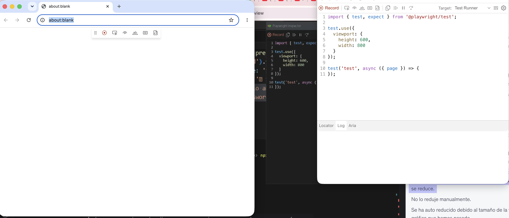


26. Doy `[Ctrl]`+`[C]` en la `TERMINAL`, para finalizar el proceso.
27. El siguiente comando que vas a aprender es si quisiéramos inspeccionar el navegador en un dispositivo específico, por ejemplo, en digamos si quisiera probar esto, cómo se ejecutará en el iPhone 11 Pro. </br>Así que en ese caso, lo que tengo que hacer es que tengo que pasar un argumento llamado como dispositivo igual a.</br>Y sólo necesito pasar el nombre del dispositivo: </br> `npx playwright codegen --device="iPhone 11 Pro"` </br> 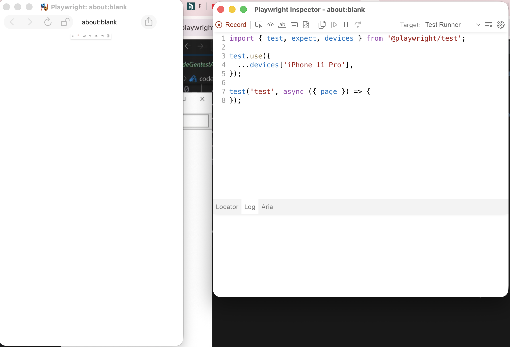


28. Doy `[Ctrl]`+`[C]` en la `TERMINAL`, para finalizar el proceso.
29. Si queremos todas las opciones usar este comando: </br>`npx playwright codegen --help` </br> Nos sale un texto similar a este:
```dos
Usage: npx playwright codegen [options] [url]

open page and generate code for user actions

Options:
  -o, --output <file name>             saves the generated script to a file
  --target <language>                  language to generate, one of javascript, playwright-test, python, python-async, python-pytest, csharp, csharp-mstest,
                                       csharp-nunit, csharp-xunit, java, java-junit (default: "playwright-test")
  --test-id-attribute <attributeName>  use the specified attribute to generate data test ID selectors
  -b, --browser <browserType>          browser to use, one of cr, chromium, ff, firefox, wk, webkit (default: "chromium")
  --block-service-workers              block service workers
  --channel <channel>                  Chromium distribution channel, "chrome", "chrome-beta", "msedge-dev", etc
  --color-scheme <scheme>              emulate preferred color scheme, "light" or "dark"
  --device <deviceName>                emulate device, for example  "iPhone 11"
  --geolocation <coordinates>          specify geolocation coordinates, for example "37.819722,-122.478611"
  --ignore-https-errors                ignore https errors
  --load-storage <filename>            load context storage state from the file, previously saved with --save-storage
  --lang <language>                    specify language / locale, for example "en-GB"
  --proxy-server <proxy>               specify proxy server, for example "http://myproxy:3128" or "socks5://myproxy:8080"
  --proxy-bypass <bypass>              comma-separated domains to bypass proxy, for example ".com,chromium.org,.domain.com"
  --save-har <filename>                save HAR file with all network activity at the end
  --save-har-glob <glob pattern>       filter entries in the HAR by matching url against this glob pattern
  --save-storage <filename>            save context storage state at the end, for later use with --load-storage
  --timezone <time zone>               time zone to emulate, for example "Europe/Rome"
  --timeout <timeout>                  timeout for Playwright actions in milliseconds, no timeout by default
  --user-agent <ua string>             specify user agent string
  --user-data-dir <directory>          use the specified user data directory instead of a new context
  --viewport-size <size>               specify browser viewport size in pixels, for example "1280, 720"
  -h, --help                           display help for command

  Examples:

    $ codegen
    $ codegen --target=python
    $ codegen -b webkit https://example.com
```

## Section 7: Trace Viewer

### 32. What is Trace Viewer ?

1. En playwright, el visor de trazas es una herramienta GUI que ayudará a visualizar la prueba ejecutada junto con instantáneas, línea de tiempo y otros detalles que se denominan trazas. </br>Veamos ahora cómo activar este visor de trazas, empezamos abriendo el archivo **`playwright.config.ts`**, y buscamos el texto </br> `trace:`
2. El valor actual es este: </br> `trace: 'on-first-retry',`</br> Primer reintento.Ahora, lo que significa es que el rastreo se habilitará cuando la prueba se rastree por primera vez. Así que para ver este rastro, lo que tenemos que hacer es fallar voluntariamente una prueba.
3. También buscamos el valor de reintentos, para ponerlo en 1, el valor actual es este: </br> `retries: process.env.CI ? 2 : 0,`
4. Simplemente lo cambiamos a este: </br> `retries: 1`
5. Copio el archivo **`030_codeGentest.spec.ts`**, en este otro archivo **`032_codeGentest.spec.ts`** y hacemos uno cambio en la línea 10:</br> `await page.getByRole("button", { name: "LoginX" }).click();`
6. Acorto el tiempo de espera del valor por defecto a solo 5 segundos en el **`playwright.config.ts`**, justo encima del `testDir`: </br> `timeout: 5 * 1000,`
7. En la `TERMINAL`, ejecutamos este comando: </br> `npx playwright test 032_codeGentest.spec.ts --project=chromium --headed` </br> 


8. Detallemos en el informe los tabuladores de:
* `Run`
* `Retry #1`
9. Dentro de `Retry #1`, buscar la opción de `Traces` y darle clic a la imagen: </br> 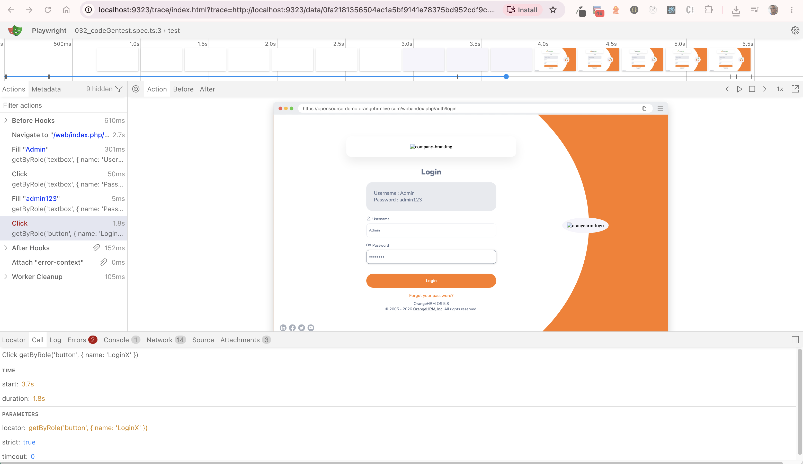 </br> Veamos ahora cuáles son los componentes del vídeo de prueba:
* El carril superior se denomina línea de tiempo, que mostrará el tiempo que se tardó en ejecutar cada comando.
* Y en el panel izquierdo se llama como la pestaña de acción, que contiene los metadatos.
* La pestaña Acción muestra todos y cada uno de los pasos que se ejecutan junto con las capturas de pantalla.
* En esta captura de pantalla también aparece antes y después de la vista.
* Así que lo que quiero decir con esto es que aquí está tratando de ejecutar a esta página web.
* Y aquí no puede mostrar un antes y un después, porque este es el primer elemento que aparece después de que se carga la página web.

10. Presionamos las teclas `[Ctrl]`+`[C]`, en la `TERMINAL`.


### 33. Different ways to open Trace Viewer

1. En el último vídeo, hemos abierto el visor de trazas directamente desde la vista de informes. </br>Así que una vez que el informe se ha generado y se abre en el navegador, si nos desplazamos hacia arriba en la sección de trazas aquí, podemos ver la vista de trazas. </br>Y si hago clic en esto se abrirá automáticamente el visor de trazas para nosotros.
2. Buscamos la carpeta **"test-results"**, y allí hay dos carpetas:
* **"032_codeGentest-test-chromium"**
* **"032_codeGentest-test-chromium-retry1"**
3. Copiamos este comando en la `TERMINAL`: </br> `npx playwright show-trace ./test-results/032_codeGentest-test-chromium-retry1/trace.zip` </br> Abre algo parecido a esto: </br> 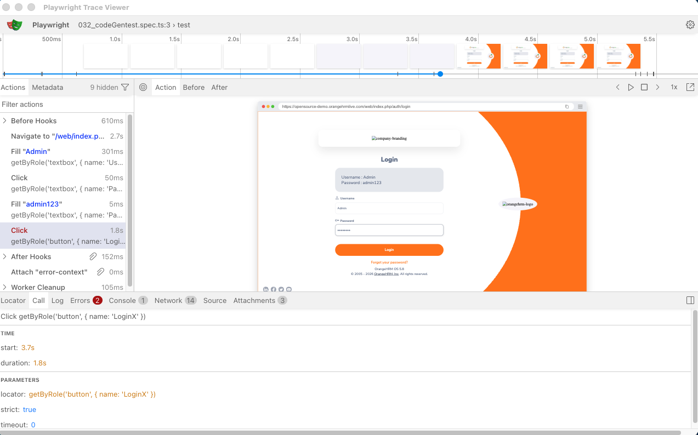


4. En un browser cualquiera como `Chrome`, en a _URL_ escribimos este texto: </br> `trace.playwright.dev` y aparece algo como esto: </br> 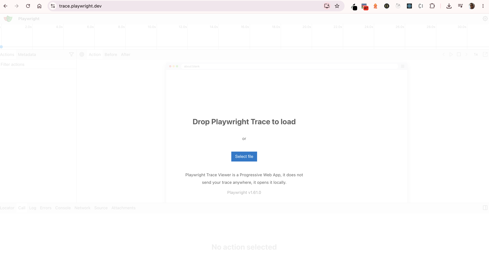


5. Arrastramos el archivo **`test-results/032_codeGentest-test-chromium-retry1/trace.zip`** y vemos un resultado similar.


### 34. What are the Various options in Trace Viewer

1. Podemos cambie en **`playwright.config.ts`**, mas opciones para el valor de `trace:`, por ejemplo: </br>Indica si se debe grabar vídeo para cada prueba. Por defecto, está desactivado. La ejecución inicial de una prueba se denomina "primera ejecución"; las ejecuciones posteriores causadas por reintentos se denominan "reintentos".
 * `'off'`: Do not record video.
 * `'on'`: Record and keep a video for every run.
 * `'on-first-retry'`: Record and keep a video only for the first retry of a test.
 * `'on-all-retries'`: Record and keep a video for every retry.
 * `'retain-on-failure'`: Record a video for every run, but keep it only for runs that failed. A failed run's
   video is kept even when a later retry passes.
 * `'retain-on-first-failure'`: Record a video only for the first run of a test (not for retries), and keep it only if that run failed.
 * `'retain-on-failure-and-retries'`: Record a video for every run, and keep it for any run that failed or that is a retry.
2. Si borro del archivo **`playwright.config.ts`**, la línea: </br> `retries: 1,` </br> y tengo un error, el no hará reintentos, sino que fallará a la primera.
3. Dejamos el valor inicial, para que no falle cuando se suba al repositorio.


### 35. Editing Trace Viewer options via command line

1. En este vídeo, entenderemos cómo pasar las opciones del visor de trazas a través de la línea de comandos. </br>Hasta ahora, hemos establecido el valor de traza en la configuración de playwright, pero también podemos establecerlo directamente en la línea de comandos cuando ejecutamos la prueba. </br>El valor que introduzcamos en la línea de comandos sobrescribirá los valores mencionados en **`playwright.config.ts`** </br>Así, por ejemplo, digamos que por defecto el valor de la traza está en primer lugar es como por defecto.
2. Digamos que quiero habilitar esta traza, pero sin cambiar el **`playwright.config.ts`**. Ingresamos este comando: </br> `npx playwright test --trace off`
3. Creo una falla a proposito en **`tests/032_codeGentest.spec.ts`**, en el `"button"`, poniendo `"LoginX"`, y repito el comando anterior en la `TERMINAL`. </br> Se genera el error, con los dos intentos, sin el _trace_: </br> 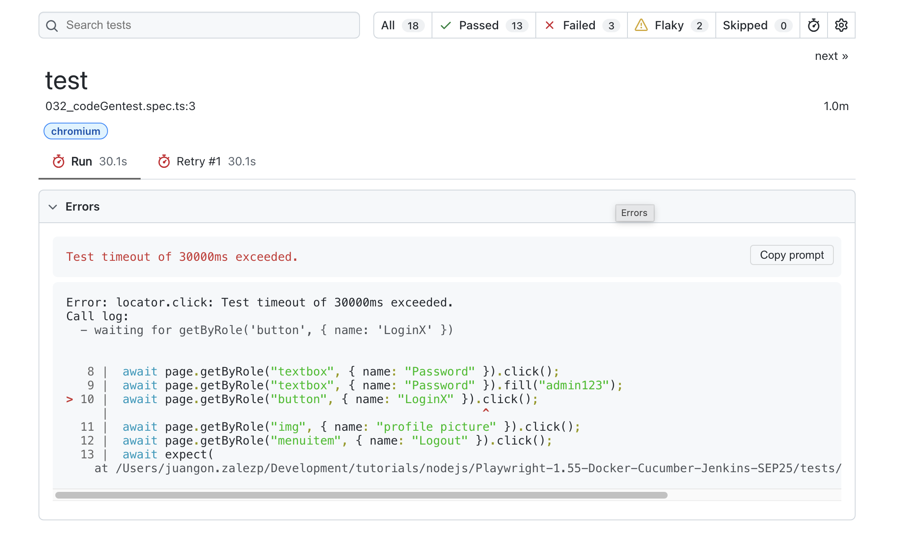


4. Hagamos este otro comando: </br> `npx playwright test --trace on` </br> Obtenemos el botón u opción `[Trace]`: </br> 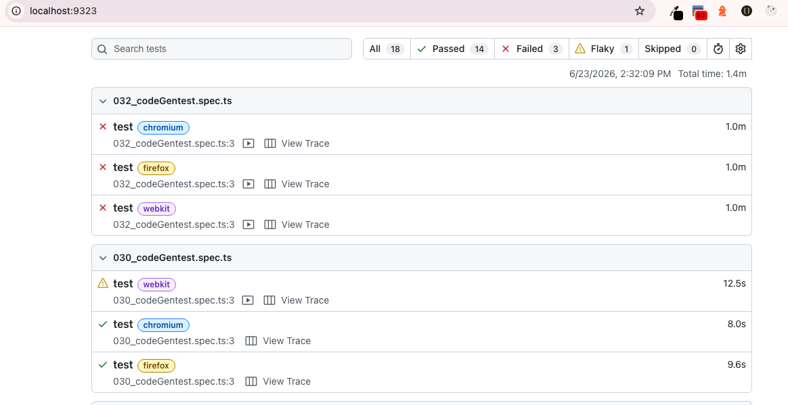


5. Corregimos el error antes de subir al repositorio y terminamos el proceso en la `TERMINAL`.


### 36. How to Set tracing programmatically

1. En este vídeo, aprenderemos a configurar el seguimiento mediante programación dentro del propio archivo de especificaciones de la prueba. </br>La razón principal de hacer esto de esta manera es digamos que queremos ver la traza para una sola prueba, en lugar de hacer los cambios globalmente en los conflictos de playwright, lo que afectará a todas las pruebas. </br>En su lugar, podemos añadirlo a una prueba específica que necesitemos.
2. Copiamos el archivo **`tests/032_codeGentest.spec.ts`**, por este otro: **`tests/036_traceTest.spec.ts`**
3. Cambiamos el contenido de `test("test"` por `test("traceTest"`.
4. Al lado de `(( test`, agregamos otro parámetro:
```js
test("traceTest", async ({ page, context }) => {
	await context.tracing.start({ screenshots: true, snapshots: true });
...
});
```
5. Antes de cerrar esta prueba agrego el `stop` del `tracing`:
```js
test("traceTest", async ({ page, context }) => {
	await context.tracing.start({ screenshots: true, snapshots: true });
...
	await context.tracing.stop({ path: "traceTest.zip" });
});
```
6. En la `TERMINAL`, ejecutamos este comando: </br> `npx playwright test --project=chromium --headed` </br> Al final aparece el archivo nuevo **`traceTest.zip`**.
7. Ejecutamos este comando para ver lo que contiene el nuevo _trace_: </br> `npx playwright show-trace ./traceTest.zip` </br> 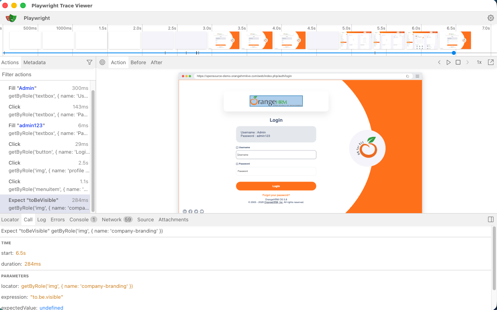


8. Cerramos la ventana que abrió para visualizar el _trace_. No necesito hacer cambios de nada, todas las pruebas entan correctas.


## Section 8: Locator Strategies

### 37. Different Locator Strategies

1. En este vídeo, entenderemos qué se entiende por localizador y cuáles son las distintas estrategias para encontrarlo. </br> En primer lugar, entendamos qué es un localizador. </br> En la página web, todos los campos tendrán un componente en Dom para identificarlo. </br> Necesitamos un localizador para saber más sobre Dom y el localizador.
2. Abriremos nuestro sitio web de demostración: </br> `https://www.saucedemo.com/`
3. Damos clic derecho sobre el cuadro de `Username` y seleccionamos `Inspect` o `Inspeccionar`. </br> 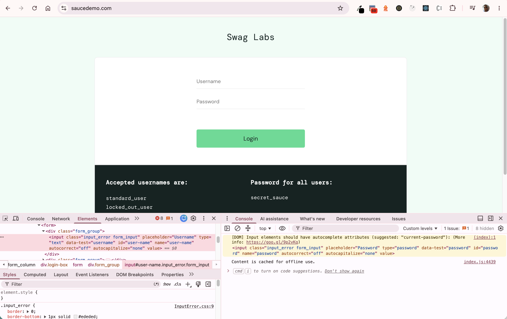


4. Cerremos el cuadro de _Dock_ y probamos con la tecla `[F12]`, obtenemos la misma imagen.
5. Seleccionamos con la herramienta de selección  o las teclas `[Ctrl]`+`[Shift]`+`[C]` on Windows/Linux, or `[Cmd]`+`[Option]`+`[C]` on MAC, para seleccionar el cuadro de `Username`.
6. Esto es el contenido de el cambpo seleccionado:
```html
<div class="form_group">
  <input class="input_error form_input" placeholder="Username" type="text" data-test="username" id="user-name" name="user-name" autocorrect="off" autocapitalize="none" value="">
</div>
```
7. Presiono o las teclas `[Ctrl]`+`[F]` o `[Cmd]`+`[F]` y escribimos el símbolo numeral (`#`) y luego el contenido del `id=`, sin las comillas: </br> `#user-name` </br> y miren que nos resalta: </br> ![[Ctrl]+[F]/[Cmd]+[F] #user-name](images/2026-06-23_165707.png "[Ctrl]+[F]/[Cmd]+[F] #user-name")


8. Probemos con este otro luego de presionar `[Ctrl]`+`[F]` o `[Cmd]`+`[F]` y escribimos esto: </br> `[name="user-name"]"` </br> y miremos que queda resaltado: </br> ![[Ctrl]+[F]/[Cmd]+[F] [name="user-name"]](images/2026-06-23_170324.png '[Ctrl]+[F]/[Cmd]+[F] [name="user-name"]')


9. Luego de presionar `[Ctrl]`+`[F]` o `[Cmd]`+`[F]` y escribimos esto: </br> `[id="user-name"]"` </br> y miremos que queda resaltado.
10. Otra opción es con _XPath_, y se empieza con un doble `//` </br> `//input[@name="user-name"]` </br> ![[Ctrl]+[F]/[Cmd]+[F] //input[@name="user-name"]](images/2026-06-23_171140.png '[Ctrl]+[F]/[Cmd]+[F] //input[@name="user-name"]')


11. Estas son las estrategias generales para encontrar cualquier elemento en la _WEB_.


### 38. How to find locators which Playwright supports

1. Iniciamos creando en la carpeta **"tests"**, el archivo **`038_locatorStrategy.spec.ts`**.
2. La primera linea importamos `{test}` de `@playwright/test`.
3. Creamos un `test`  de nombre `Locator Strategy Test`, con una función asincrónica que apunta al objeto `page`, y el `page.goto` navegando a `saucedemo.com`:
```js
import {test} from '@playwright/test';

test('Locator Strategy Test', async ({ page }) => {
  // Navigate to the target page
  await page.goto('https://www.saucedemo.com/');
});
```
4. Buscamos de dicha página, el primer campo, el cuadro de texto llamado `Username`, dando clic derecho y seleccionando `Inspect`, siempre se sugiere utilizar el `id`, con `page.locator`, para hacer un llenado o `fill`:
```js
  // page.locator('id="user-name"').fill('standard_user');
  await page.locator('#user-name').fill('standard_user');
```
5. Hacemos lo mismo para el cuadro de `Password`, usando también el `page.locator`:
```js
  // Use a XPath to find the password input field
  await page.locator('//input[@id="password"]').fill('secret_sauce');
```
6. Otras opciones pueden ser _CSS_:
```js
  // Click the login button using a CSS selector
  // page.locator('text="Login"').click();
  // page.locator('input:has-text("Login")').click();
  await page.locator('button[type="submit"]').click();
```

### 39. Easily find locators using Playwright inspector

1. Copio el archivo **`038_locatorStrategy.spec.ts`** en **`039_locatorStrategy.spec.ts`**.
2. Borro el cotenido debajo de `page.goto` y añado un `page.pause`.
3. Ejecuto este test con el comando en la `TERMINAL` de : </br> `npx playwright test 039_locatorStrategy --project=chromium --headed`
4. Se detiene en la _pause_ y muestra una pantalla de `Playwright Inspector`: </br> 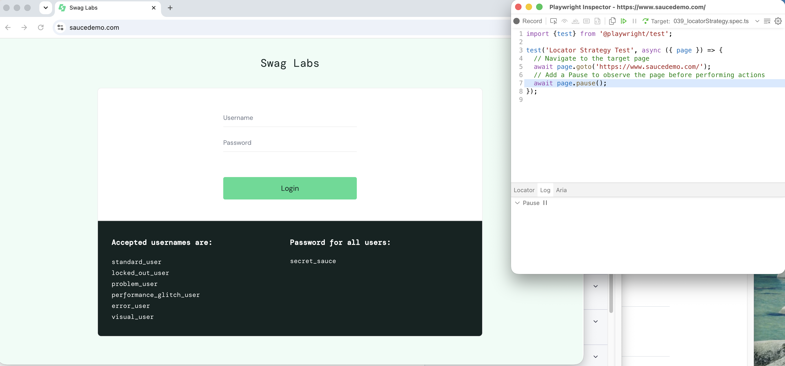


5. Selecciono en la parte superior, al lado de `Record` el ícono de  `Pick Locator` y luego señalo el cuadro de texto de `Username`: </br> </br>`locator('[data-test="username"]')`


6. Repito el proceso para señalar el cuadro de texto de `Password` y esto me aparece en el cuadro de `Locator`: </br>`locator('[data-test="password"]')`
7. Repito despuespués de dar click al ícono de `Pick Locator`, y luego el botón de `Login`, y en la celda de `Locator`sale esto: </br> `locator('[data-test="login-button"]')`
8. Aprovecho esta información obtenido y la añado al archivo **`039_locatorStrategy.spec.ts`**:
```js
import {test} from '@playwright/test';

test('Locator Strategy Test', async ({ page }) => {
  // Navigate to the target page
  await page.goto('https://www.saucedemo.com/');
  // Add a Pause to observe the page before performing actions
  // await page.pause();
  // Locate with the data-test attribute
  await page.locator('[data-test="username"]').fill('standard_user');
  await page.locator('[data-test="password"]').fill('secret_sauce');
  await page.locator('[data-test="login-button"]').click();
  // Verify that the user is logged in by checking for the presence of the inventory container
  await page.locator('.inventory_container').isVisible();
});
```
9. Detengo la ejecución en la `TERMINAL` y vuelvo a ejecutar el comando del paso 3.
10. Este es el resultado de `npx playwright show-report` </br> 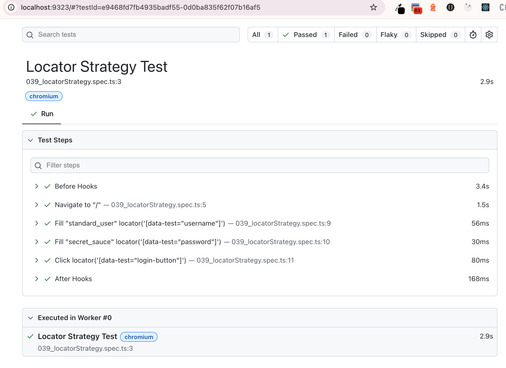


11. Cerramos la ejecución con `[Ctrl]`+`[C]`


### 40. Plugins available to find Locators very easily

1. Instalar en el _Browser_ uno de estos _pluggings_ o Extensiones:
* `SelectorHub`
* `LetXPath`
2. El primero da opciones variadas de localizar un elemento
3. El segundo no aparece ya en el `Chrome web store`.

---

## Section 9: Writing Login scenario test & Assertions

### 41. How to write Login Test ?

1. Creamos el archivo **`041_loginTest.spec.ts`**,y empezamos con la importación de `test` y `expect`:
```js
import { expect, test } from "@playwright/test";
```
2. Creamos una función asincrónica usando `test`, con el nombre `Login Test for Orange HRM` y con el parámetro de `page`:
```js
test("Login Test for Orange HRM", async ({ page }) => {
	
});
```
3. Usamos el parámetro `page`, para ubicarnos en la página de `orange HRM`:
```js
	await page.goto(
		"https://opensource-demo.orangehrmlive.com/web/index.php/auth/login",
	);
```
4. Seleccionamos el primer cuadro de `Username`, para llenar con el valor de `Admin`:
```js
	await page.locator('input[name="username"]').fill("Admin");
```
5. Repito el proceso para `Password` y llenarlo con `admin123`:
```js
  await page.locator('input[name="password"]').fill("admin123");
```
6. Vamos por el botón de `Login` para darle clic:
```js
	await page.locator('button[type="submit"]').click();
```
7. Como ingresa a una nueva página, debemos buscar el botón que es una imagen para desplegar el menú y dar el botón de `Logout`:
```js
	await page.locator('.oxd-userdropdown-tab').click();
	await page.locator('text=Logout').click();
```
8. Vamos a validar que exista `company-branding"` y damos cerrar:
```js
	await expect(page).toHaveURL(
		"https://opensource-demo.orangehrmlive.com/web/index.php/auth/login",
	);
	await page.close();
```
9. En una `TERMINAL` vamos a ejecutar este comando: </br> `npx playwright test 041_loginTest --project=chromium --headed`
10. El proceso finaliza satisfactoriamente


### 42. Assertion - Visible/Hidden Alternate website

**Assertion - Visible/Hidden Alternate website**
In the upcoming video we will be learning how to assert the visible/hidden element in the website.

In the video I will be doing demo with <https://sripriyapkulkarni.com/>

But unfortunately, the website isn't available anymore.

So instead of that please use - <https://www.letskodeit.com/practice>

Use under the Element Displayed Example section where it has both Show/Hide buttons.


### 43. Assertions - Visible/Hidden

1. Empecemos creando el arhivo **`043_assertionTest.spec.ts`** con solo la importación de `test` y `expect`:
```js
import { expect, test } from "@playwright/test";
```
1. Creo la función asincrónica `test`, con el texto `Visible/Hidden Assertion` y el parámetro `page`:
```js
test("Visible/Hidden Assertion", async ({ page }) => {

});
```
3. Vamos a la página que me pertenece donde añadí el botón que muestra y oculta un texto:
```js
  await page.goto("https://jdgonzal.github.io/alquimia-software/");
```
>[!WARNING]
>
> El sitio propuesto por el instructor `https://sripriyapkulkarni.com/` ya no funciona.

4. Buscamos con el `Inspect` el texto que vamos a validar, si está o no presente:
```js
  await expect(page.locator('#miTexto')).toBeVisible(); 
```
5. Inspecciono el botón para para darle el clic:
```js
  await page.locator('#miBoton').click();
```
6. Y vuelvo a validar que el texto no sea visible:
```js
  await expect(page.locator('#miTexto')).toBeHidden();
```
7. Cerramos todo : </br> `await page.close();`
8. Ejecuto en una `TERMINAL`, el comando para la prueba: </br> `npx playwright test 043_assertionTest --project=chromium --headed`
9. Corro la verificación con: </br>`npx playwright show-report` </br> 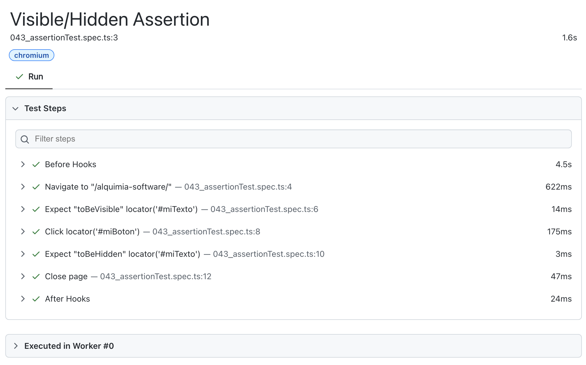


10. Finalizamos con `[Ctrl]`+`[C]`, para salir del reporte.

### 44. Assertions - Present/Not Present

1. Empiezo creando el archivo **`044_assertionTest.spec.ts`**, copiando del archivo anterior **`043_assertionTest.spec.ts`**, con la importación de `test` y `expect`, luego una función asincrónica cobn el parámetro `page`, apuntando al sitio `https://the-internet.herokuapp.com/add_remove_elements/`:
```js
import { expect, test } from "@playwright/test";

test("Present/Not Present Assertion", async ({ page }) => {
  await page.goto("https://the-internet.herokuapp.com/add_remove_elements/");

await page.close();
```
2. Verificamos que no esté presente el texto de la clase `added-manually`:
```js
  await expect(page.locator('.added-manually')).not.toHaveCount(1);
```
3. Verificamos con la ejecución de la prueba desde la `TERMINAL`, con el comando: </br>`npx playwright test 044_assertionTest --project=chromium --headed`
4. Presionamos el botón para que se cree el nuevo objeto y validamos que esté presente:
```js
  await page.locator('button[onclick="addElement()"]').click();
  await expect(page.locator('.added-manually')).toHaveCount(1); 
```
5. Volvemos a ejecutar en la `TERMINAL` el comando del paso 3, y pasa el proceso sin errores.

### 45. New Website on Assertion - Enabled/Disabled

>[!WARNING]
>
> ### New Website on Assertion - Enabled/Disabled
>
> * In the next video I am using <https://letcode.in/buttons>
>
> * **But the website url has been changed to  <https://letcode.in/button>**


### 46. Assertions - Enabled/Disabled

1. Creo el archivo **`046_assertionTest.spec.ts`** copiando el archivo **`044_assertionTest.spec.ts`**.
2. Cambiamos el texto del `test` por `Enabled/Disabled Assertion`.
3. La ruta para el `goto` es `https://letcode.in/button` y borramos el resto, dejando algo así:
```js
import { expect, test } from "@playwright/test";

test("Enabled/Disabled Assertion", async ({ page }) => {
  await page.goto("https://letcode.in/button");

  await page.close();
});
```
4. Inspecciono el botón con el texto `How tall & fat I am?`, tanto con el `Inspect` como el `SelectorHub`: </br> 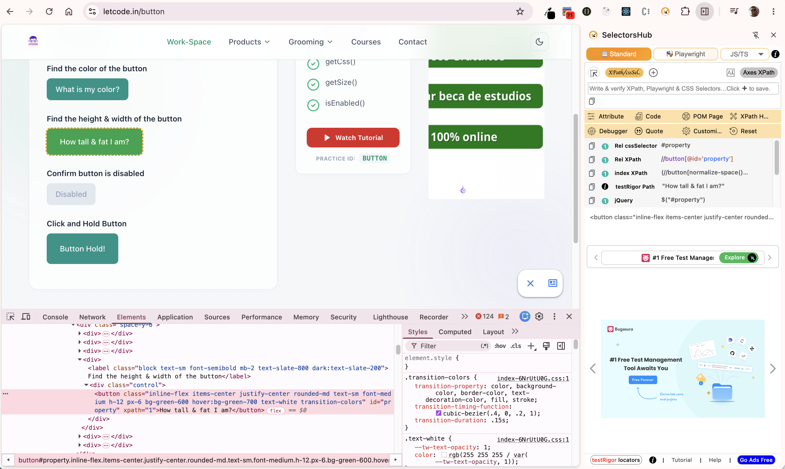


5. Hago clic al elemento con el `id` de nombre `#property` </br> `await page.locator("#property")` </br> Una vez obtenido lo uso para un `expect`:
```js
  await expect(page.locator("#property")).toBeEnabled();
```
6. Seleccionamos el botón con el texto `Disabled`, que tiene un `id` de nombre `isDisabled`:
```js
 await expect(page.locator("#isDisabled")).toBeDisabled();
```
7. En una `TERMINAL`, ejecuto el comando: </br> `npx playwright test 046_assertionTest --project=chromium --headed`
