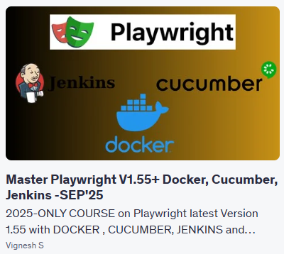

# Master Playwright V1.55+ Docker, Cucumber, Jenkins -SEP'25

## Playwright-1.55-Docker-Cucumber-Jenkins-SEP25

[](https://www.udemy.com/course/master-Playwright-docker-cucumber-jenkins)

>[!IMPORTANT]
>
>**What you'll learn**
>
> * By end of this course, you will be a master in 2024 `Playwright` with latest version
> * You will be able to build robust framework using `Playwright` + Docker + Cucumber + Jenkins
> * Complete knowledge on how to write test in Cucumber BDD style
> * Complete knowledge on Docker and how to run tests inside docker
> * Complete understanding of `Playwright` Components such as codeGen, fixtures, screenshots and videos
> * Usage of `Playwright` in real world automation end to end testing
> * Gain complete knowledge on Web Automation techniques and tricks
> * Practical knowledge in designing framework from scratch

## Section 1: Introduction


### 1. Must Watch before Enrolling the course

>[!NOTE]
>
>¿Está cansado de buscar un curso de dramaturgia que le resulte difícil mantener
>al día?
>No busque más.
>
>Presentamos nuestro nuevo curso actualizado, repleto de contenidos de vanguardia que elevarán tus habilidades
>a nuevas cotas.
>
>Me he tomado el tiempo de ir más allá y ofrecerle el curso más actualizado del mercado.
>Me complace anunciar que nuestro curso se ha grabado con la última versión de `Playwright`, lo que garantiza
>el aprendizaje de las técnicas más pertinentes y las mejores prácticas.
>Pero eso no es todo.
>
>No pierdas el tiempo con los materiales obsoletos y los vídeos de baja calidad que hay por ahí.
>Únase a nosotros hoy mismo y acceda al curso más completo, actualizado y de mayor calidad sobre dramaturgia disponible
>en el mercado.
>¿A qué esperas?
>Inscríbase ahora y lleve sus habilidades al siguiente nivel con nuestro nuevo curso de dramaturgia.
>

### 2. Important Note Before Starting Course

>[!NOTE]
>
>Antes de empezar con el contenido del curso, tengo una pequeña petición de mi parte solicitando a todos ustedes que den
>
>una calificación de cinco estrellas a este curso.

### 3. Important to WATCH

>[!NOTE]
>
>Has llegado a la página de este curso a través de una búsqueda en Udemy, de un anuncio de Google o de cualquier otra plataforma
>social.
>
>Te pido que te tomes un momento para comprar el curso a través del truco que te voy a mostrar ahora.
>Así que para todos los cursos que tengo, Udemy me da cupones cada mes para añadir descuentos a esos cursos.


### 4. Course Introduction

>[!NOTE]
>
>`Playwright` es un marco de automatización web de código abierto desarrollado por Microsoft.
>Entonces todos nos preguntaremos por qué elegir `Playwright` en lugar de otras herramientas de automatización.
>
>Porque `Playwright` es el futuro de las pruebas de automatización web.
>`Playwright` gana por goleada a todas las herramientas de automatización existentes como `Selenium`, `Cypress`, WebDriver, IO e incluso puppeteer
>debido a las abundantes características empaquetadas en `Playwright` que no están disponibles en estas herramientas.
>Este curso está bien estructurado y diseñado para principiantes.
>
>Si no tienes conocimientos previos sobre `Playwright` o incluso sobre el lenguaje como TypeScript, entonces este es el curso
>adecuado para ti.
>Porque como parte de este curso, junto con el `Playwright`, también te enseñaré el lenguaje TypeScript
>desde cero.
>

### 5. Course Content Walkthrough

>[!NOTE]
>
>
>
> * El primer tema es la interacción entre `Playwright`.
>Aquí aprenderemos en detalle sobre `Playwright` junto con sus arquiteSyllabus Walk throughcturas y las características que
>ofrecen.
>
> * Y en segundo lugar vamos a aprender acerca de la instalación y configuración aquí.
>En esta sección, aprenderemos paso a paso la configuración de cómo instalar `Playwright` en varios sistemas operativos
>y cómo configurar el proyecto.
>
> * Y en la siguiente sección veremos nuestras estrategias.
>Aquí aprenderemos diferentes estrategias de localización y cómo utilizarlas para automatizar la interfaz de usuario web.
>
> * Y la siguiente sección es la generación automática de código.
>Esta es una de las grandes características que ofrece `Playwright`, donde aprenderemos a autogenerar el código
>de `Playwright` sin escribir una sola línea de código.
>
> * La siguiente sección es un elemento básico de la interfaz de usuario.
>Aquí aprenderemos a manejar los elementos básicos de interfaz de usuario en `Playwright`, como cuadro de texto, botones, casilla
>de verificación, botón de radio, etcétera.
>
> * Y el siguiente tema es el elemento UI avanzado.
>Aquí aprenderemos a manejar los elementos avanzados de la interfaz de usuario web, como alertas, marcos de calendario, etcétera.
>
> * A continuación aprenderemos sobre la creación del marco.
>Este es uno de los temas cruciales de este curso.
>Aquí aprenderemos a crear un framework de primera desde cero.
>
> * La próxima sección tratará sobre las pruebas.
>Junto con las pruebas de interfaz de usuario, también aprenderemos a realizar pruebas de API utilizando `Playwright`.
>
> * La siguiente sección es el `Cucumber`.
>Aprenderemos a integrar cucumber con `Playwright` para escribir el test estilo BDD.
>
> * La siguiente sección es Docker.
>Aprenderemos a integrar el Docker con `Playwright` para ejecutar la prueba `Playwright` dentro del contenedor
>Docker.
>
> * Y la siguiente es la integración con Jenkins.
>Aprenderemos a crear un proyecto Jenkins y a ejecutar las pruebas a través del pipeline Jenkins.
>
> * Y el último tema sería lo básico de TypeScript.
>Cubriremos TypeScript desde lo básico hasta temas avanzados.

### 6. How to Reach out to Instructor

>[!NOTE]
>
>

### 7. What is `Playwright` ?

>[!NOTE]
>
>
>
>En este video, vamos a entender en profundidad qué es `Playwright` y cuáles son las grandes características
>que `Playwright` nos ofrece.
>
>En primer lugar, aprenderemos qué es un `Playwright`.
>`Playwright` es un marco de automatización web de código abierto desarrollado por Microsoft.
>Es un Nodo. js herramienta de automatización de bibliotecas.
>
>`Playwright` está escrito en TypeScript, que es un superconjunto de JavaScript que añade tipado estático opcional
>y otras características al lenguaje.
>
>Veamos ahora cuáles son las principales características que ofrece el `Playwright`.
>
> * **La característica clave más importante es la compatibilidad entre navegadores**. </br>
>`Playwright` es compatible con todos los motores de renderizado modernos, incluidos chromium, WebKit y Firefox.
>Por lo tanto, si escribe su prueba una vez en `Playwright` test, puede ejecutar estas pruebas en todos los navegadores
>que desee.
>
> * **La segunda característica clave importante es la prueba multiplataforma en windows, Linux y macOS de forma local o en headless o header.** </br>
>Lo que significa que `Playwright` es compatible para trabajar con cualquier sistema operativo y se ejecutará incluso en local
>o incluso en cualquiera como Jenkins o Circleci, tanto en modo headless como headed.
>
> * **La siguiente característica es el lenguaje cruzado.**</br>
>Mediante la API de `Playwright`, podemos escribir el script de `Playwright` en TypeScript, JavaScript,
>Python, DotNet e incluso en Java.
>
> * **La siguiente característica importante es probar la emulación móvil nativa de Google Chrome para Android y Safari para móviles.**</br>
>El mismo motor de renderizado funciona en un ordenador de sobremesa y en la nube.
>Cuando escribimos nuestra prueba `Playwright`, además de probar en el navegador web, también podemos modificar nuestra prueba para que
>se ejecute de la misma forma que funciona en los navegadores móviles.
>
> * **La siguiente es la automatización fiable.**</br>
>`Playwright` gestiona los fallos del navegador, garantizando una automatización estable y coherente.
>La siguiente función es la depuración mejorada.
>
> * **Depure fácilmente el código de automatización con herramientas detalladas de inspección y mensajes de error**. </br>
>Siempre que se produzca un fallo en nuestra prueba de `Playwright`, `Playwright` le dará un mensaje de error detallado
>e incluso le indicará dónde se produce el error, junto con las herramientas de inspección.
></br></br>
>
>La siguiente característica clave es la automatización.
>Esta es una de las características más importantes del `Playwright`.
>
>
>
> * **El `Playwright` espera a que los elementos sean accionables antes de realizar las acciones.**</br>
>También cuenta con un rico conjunto de eventos de introspección.
>La combinación de ambos elimina la necesidad de tiempos de espera artificiales, que es la causa principal de las pruebas
>defectuosas.
>Cuando trabaje con `Playwright`, ya no tendrá que mencionar el tiempo de espera manualmente.
>Playwright lo hace automáticamente por nosotros.
>
> * **La siguiente característica clave son las afirmaciones _web first_.**</br>
>Las aserciones de `Playwright` se crean específicamente para la web dinámica.
>Los cheques se retiran automáticamente hasta que se cumplen las condiciones necesarias.</br>
>Playwright incorpora aserciones especialmente diseñadas para la automatización web.
>
> * **La siguiente función es el rastreo**.
>   * Configurar este retroceso.
>   * Estrategia.
>   * Captura.
>   * Ejecución.
>   * Rastro.
>   * Vídeos.
>   * Capturas de pantalla.
>
>Para eliminar la flexión.
>Incluso podemos configurar para rastrear la prueba cuando hay un fallo.
>
> * **La siguiente es probarlo todo.**</b>
>Los escenarios de prueba que abarcan varias pestañas, varios orígenes e incluso varios usuarios pueden probarse fácilmente
>con `Playwright`.
>Cree escenarios con diferentes contextos para diferentes usuarios y ejecútelos en su servidor.
>Todo en una sola prueba.
>
> * **La siguiente función es Eventos de confianza.**
>Sin embargo, los elementos que interactúan con los controles dinámicos.
>Producir eventos de confianza.
>`Playwright`,
>Utilizar canalizaciones de entrada de navegador reales indistinguibles del usuario real.
>Usando `Playwright`, podemos crear eventos de confianza para el navegador, que se asegurará de cómo el usuario en tiempo
>real lo utiliza.
>
> * **El siguiente es Frames y _Shadow-DOM_**.</br>
>El `Playwright` nos selecciona.
>Perfora el domo de sombra y permite entrar en los marcos sin problemas.
>Esta es una de las características clave de `Playwright` que no ofrecen otras herramientas de automatización.
>
>
>
> * **Contexto del navegador**. </br>
>`Playwright` crea un contexto de navegador para cada prueba.
>El contexto del navegador equivale a un nuevo perfil de navegador.
>Así se consigue un aislamiento total de las pruebas sin sobrecarga.
>Crear un nuevo contexto de navegación sólo lleva un puñado de milisegundos.
>Cada prueba se ejecutará en un nuevo contexto, lo que significa que una prueba no obstaculizará la ejecución de otras.
>
> * **La siguiente característica clave es el inicio de sesión.**</br>
>Una vez, guarda el estado de autenticación de automatización del contexto, y lo reutiliza en todas las pruebas.
>Así que si tu
>UI necesita una autenticación, entonces tenemos que guardar que sólo una vez.
>Usando `Playwright` rest, todo se manejará solo.
>
> * **La siguiente función es la cadena de código.**
>Esta es de nuevo una característica muy importante en `Playwright`, donde esta función de entrenamiento nos ayuda a generar la prueba mediante el
>registro de nuestras acciones en la interfaz de usuario, y creará automáticamente la prueba `Playwright` para nosotros.
>Ni siquiera necesitamos escribir manualmente la prueba.
>
> * La siguiente función es la de inspector de `Playwright`.
>Podemos inspeccionar la página, generar los selectores y recorrer la ejecución de la prueba viendo los puntos
>de clic y explorando los registros de ejecución.
>Este inspector `Playwright` nos ayuda en la obtención de los localizadores, e incluso a ver el paso a paso de la ejecución de
>la prueba.
>La siguiente función clave es Trace Weaver, que captura toda la información para investigar el fallo de la prueba.
>`Playwright`.
>Trace contiene la ejecución de la prueba, screencast, instantáneas en vivo Dom, acciones Happen y el recurso de prueba,
>y muchos más.
>

### 8. Architecture of `Playwright` vs. Other Automation Tools

>[!NOTE]
>
>
>
>A modo de comparación, tomemos el `Selenium`.
>`Selenium` es una popular herramienta de automatización de código abierto utilizada para validar aplicaciones web en diferentes navegadores.
>
>En primer lugar, entendamos la arquitectura del `Selenium`.
>`Selenium` trabaja sobre el protocolo de conexión Http.
>Esto significa que después de activar la prueba, todo el código `Selenium` escrito por nosotros, que es
>el cliente, se convertirá a formato Json.
>
>El Json generado se envía al controlador del navegador, que es un servidor a través del protocolo Http, y el controlador del navegador
>comunica el código correspondiente al navegador.
>En este caso, el controlador actúa como intermediario entre el cliente y el navegador.
>
>
>
>Ahora veamos al `Playwright`.
>Arquitectura.
>
>Aunque `Playwright` funciona con un protocolo de conexión WebSocket, esto significa que una vez que lance la prueba, el
>código se ejecutará directamente en el navegador.
>En `Playwright` no existe el concepto de conductor de navegador intermediario.
>
>
>
>Ahora veremos cuál es la diferencia entre la conexión WebSocket frente al protocolo de conexión Http.
>
> * `Selenium` envía cada comando como una petición Http separada y recibe respuestas Json.
>Así, cada acción como abrir el navegador, hacer clic en un elemento o enviar teclas en un cuadro de texto se envía como
>una petición Http independiente.
>Además, tras la finalización de cada solicitud, se terminará la conexión entre el servidor
>y el cliente, que deberá restablecerse para la siguiente solicitud.
>Terminación de la conexión.
>Después de cada solicitud resultan en una ejecución más lenta, lo que introduce una capa de flakiness.
>
> * `Playwright`, por su parte, comunica todas las peticiones a través de una única conexión WebSocket,
>que se mantiene hasta que finaliza la ejecución del texto.
>Esto reduce los puntos de fallo y permite que los comandos se envíen rápidamente en una sola conexión.
>
>
>
> * En conclusión, a partir del diagrama de arquitectura, tenemos una idea clara de que `Selenium` necesita establecer una
>conexión antes de cada solicitud.
>
> * Por tanto, existe la posibilidad de que algunas de las peticiones tarden más tiempo en establecer la conexión,
>lo que se traduce en flaqueza.
>
> * Mientras que `Playwright` se conecta a través de un WebSocket, debido a lo cual la conexión se mantendrá hasta la finalización
>de todos los casos de prueba.
>Ejecución que hace de `Playwright` una herramienta más estable en comparación con `Selenium`.
>
>En el próximo vídeo, veremos cuáles son las ventajas en tiempo real de utilizar `Playwright` frente a otras herramientas
>del mercado.
>

### 9. Real time Advantages of using Playwright

>[!NOTE]
>
>En este vídeo, veremos en detalle cuáles son las ventajas de `Playwright` frente a las herramientas de automatización existentes
>en el mercado.
>
>Para este ejemplo, tomaremos las dos principales herramientas que conducen a las pruebas de automatización web.
>Uno es el `Selenium` y el otro es `Cypress`.
>
>
>
>Ahora veamos esta tabla una a una para entender las ventajas de `Playwright` frente a `Selenium`
>y `Cypress`.
>
> * La primera ventaja es **la compatibilidad entre procesos**.</br>
>`Playwright` por soportes nativos para chromium, Firefox y WebKit, mientras que para `Selenium` requiere una configuración
>WebDriver separada, y para `Cypress` requiere una configuración WebDriver separada también.
>
> * Y en cuanto a **la compatibilidad multilingüe**. </br> `Playwright` admite JavaScript, Python, C-sharp, Java e incluso TypeScript.
>Mientras que `Selenium` soporta Java, C, sharp, Python, Ruby y JavaScript, mientras que `Cypress` sólo se ejecutará
>en JavaScript.
>
> * La siguiente es **la automatización asíncrona**.</br>
>Ejecución asíncrona para la estabilidad y la sincronización es posible en `Playwright`, mientras que `Selenium`
>y `Cypress` trabajará en.
>`Selenium` trabajará en ejecución síncrona y `Cypress` también soportará la ejecución asíncrona.
>
> * La siguiente se basa en **las pruebas entre navegadores**.</br>
>`Playwright` elimina la configuración WebDriver separada para cada navegador, lo que significa que si escribe la prueba
>una vez, se puede ejecutar en cualquier navegador sin necesidad de configuración adicional, mientras que para `Selenium` requiere una configuración
>WebDriver separada, y para `Cypress` también requiere una configuración WebDriver separada.
>
> * La siguiente ventaja es el **inicio de la red**.</br>
>`Playwright` tiene una potente capacidad de interceptación de red, lo que significa que cuando se está ejecutando la
>prueba, podemos incluso simular la respuesta de lo que estamos recibiendo del servidor.
>Mientras que para el `Selenium` hay una interceptación limitada de la red e incluso para `Cypress` hay una interceptación
>limitada de la red.
>
> * La siguiente ventaja son **las herramientas de depuración mejoradas**.</br>
>`Playwright`.
>Por defecto, fuera de la caja da un mensaje de error detallado y herramientas de inspección cuando hay un
>fallo, mientras que Selenium y `Cypress` son limitados en términos de capacidades de depuración.
>
> * El siguiente es el **rendimiento y la eficiencia**. </br>
>En comparación con Selenium y `Cypress`, `Playwright` es una herramienta de alto rendimiento y optimizada, mientras
>que Selenium y `Cypress` son más lentas en comparación con `Playwright`,
>
> * y la última parte es **la creciente comunidad y ecosistema**. </br>
>`Playwright` es una comunidad en rápido crecimiento y hay múltiples colaboradores en todo el mundo, mientras que
>`Selenium` es una herramienta muy antigua.
>Así que hay una comunidad establecida y extensa, y `Cypress` cuenta con una comunidad activa y solidaria.
>
>Así que estas son las ventajas de `Playwright` en comparación con Selenium y `Cypress`.
>En el próximo vídeo, veremos el lenguaje y la selección del framework utilizados en este curso y por qué lo
>hemos seleccionado.
>

### 10. Reason of Choosing TypeScript Language for this Course

>[!NOTE]
>
>")
>
>
>
>
>
>
>")
>
>
>
>
>
>
>")
>
>
>
>
>
>
>")
>
>
>
>
>
>


## Section 2: Typescript Basics

### 11. Typescript Introduction

>[!NOTE]
>
>**¿Qué es TypeScript?**
>
>
>
> * TypeScript es un superconjunto estadísticamente tipado y de código abierto de JavaScript creado para mejorar el
>lenguaje de programación JavaScript.</br>
>TypeScript no es más que una envoltura construida sobre JavaScript, que tiene muchas más ventajas en comparación
>con JavaScript.
>
> * TypeScript añade tipado estático opcional, que permite a los desarrolladores especificar los tipos de variables,
>funciones, parámetros y valores de retorno de funciones.</br>
>Este sistema de tipado ayuda a detectar errores relacionados con el tipo durante el desarrollo, proporcionando mejores herramientas
>y calidad de código.
>
> * La principal diferencia entre JavaScript y TypeScript es este sistema de tipado, donde podemos detectar los problemas
>relacionados con el tipo durante el tiempo de compilación, en lugar de durante el despliegue.
>
>**Ahora entenderemos la historia de TypeScript.**
>
>
>
> * TypeScript fue presentado por primera vez por Microsoft en octubre de 2012 por Anders Hesselberg, creador de C-sharp y principal
>arquitecto del proyecto TypeScript.</br>
>Introdúzcalo para hacer frente a las limitaciones de JavaScript para aplicaciones a gran escala.
>
> * TypeScript ganó popularidad muy rápidamente debido a su capacidad para ayudar a los desarrolladores a escribir código más robusto
>y mantenible.</br>
>Grandes empresas y proyectos como angular adoptaron TypeScript, impulsando aún más su prominencia en la comunidad
>de desarrollo web.
>
>**Vamos a ver cuáles son las características de TypeScript.**
>
>")
>
> * La primera característica es la tipificación estática.
>   * TypeScript introduce la tipificación estática, permitiendo a los desarrolladores especificar los tipos de datos de las variables, parámetros
>de función y valores de retorno, lo que significa que siempre que estemos creando una variable, podemos mencionarlo específicamente.
>Por ejemplo, quería crear una variable de tipo número o de tipo cadena.
>   * Esto ayuda a detectar los errores relacionados con el tipo durante el tiempo de compilación.
>
>")
> * La siguiente característica es la inferencia de tipos.</br>
>TypeScript a menudo puede inferir tipos sin anotaciones explícitas, reduciendo la necesidad de declaraciones de tipos
>repetitivas.
>
> * Lo siguiente es la interfaz y las clases.</br>
>TypeScript admite conceptos de programación orientada a objetos como clases e interfaces, lo que permite al desarrollador
>crear un código bien
>
>")
>
> * La siguiente característica son los genéricos.</br>
>TypeScript proporciona soporte para genéricos, permitiendo a las funciones y estructuras de datos trabajar con varios
>tipos de datos manteniendo la seguridad de tipos.
>
> * Y lo siguiente son los tipos de unión e intersección.</br>
>TypeScript admite la unión, que consiste en combinar varios tipos, y la intersección de tipos, que consiste en combinar
>varios tipos en uno.</br>
>Lo que quiere decir con esto es que, por ejemplo, si quisiera crear una variable que aceptara un número
>o una cadena, esto no es posible en otros lenguajes de programación, pero es muy posible en
>TypeScript.
>
>")
>
> * Y la siguiente característica es el acceso al ecosistema JavaScript.</br>
>TypeScript es compatible con el código JavaScript existente, lo que permite a los desarrolladores adoptar TypeScript de forma
>incremental en sus proyectos.</br>
>Esta es una de las principales características por las que TypeScript fue un gran éxito, porque todos los proyectos JavaScript existentes
>se pueden convertir en un proyecto TypeScript.</br>
>La razón es porque TypeScript no es más que una envoltura de JavaScript.
>Y soporte avanzado de identificación.
>
> * TypeScript ofrece excelentes herramientas e integración con el popular entorno de desarrollo integrado,
>que se llama IDs.</br>
>Las más populares, como Visual Studio Code, que ofrece herramientas inteligentes de compleción de código, comprobación
>de tipos e incluso refactorización.
>
>Ahora hemos entendido las características de TypeScript.
>
>**Ahora veremos en qué se diferencian TypeScript y JavaScript.**
>
>")
>
> * El primero es el sistema de tipos.
>
>   * TypeScript introduce un sistema de tipos estáticos que permite a los desarrolladores especificar los tipos de los parámetros de las funciones
>variables y los valores de retorno.
>
>   * Pero en JavaScript, JavaScript es un tipo dinámico, lo que significa que los tipos de datos se determinan en tiempo de ejecución.</br>
>Así que cuando creas una variable en JavaScript, no necesitas mencionar el tipo, pero entenderá que hemos introducido una variable
>numérica o una variable de cadena durante el tiempo de ejecución.</br>
>Las variables pueden cambiar su tipo de datos durante la ejecución, lo que puede provocar un comportamiento inesperado
>en JavaScript.
>JavaScript se basa en la comprobación en tiempo de ejecución, por lo que es más propenso a los errores relacionados con el tipo.
>
>Esta es una de las principales diferencias entre TypeScript y JavaScript.
>
>")
>
> * La siguiente es la compatibilidad.
>   * TypeScript está diseñado como un superconjunto de JavaScript, lo que significa que todo el código JavaScript válido es también
>código TypeScript válido.</br>
>Esto facilita el incremento.
>Adopción de TypeScript en un proyecto JavaScript existente.
>
>   * Mientras que en JavaScript, JavaScript es un lenguaje omnipresente de la web y todos los navegadores web lo soportan de forma
>nativa, es el lenguaje por defecto para el desarrollo web y se puede utilizar sin ninguna configuración
>o compilación adicional.
>
>")
>
> * La siguiente diferencia importante es la compilación.
>   * El código TypeScript debe transpilarse o convertirse en código JavaScript antes de poder ejecutarse en un navegador
>o en un entorno NodeJS.</br>
>Esto añade un paso más al proceso de desarrollo, pero garantiza la compatibilidad con el entorno JavaScript.</br>
>Lo que significa es que si escribes un código TypeScript e intentas ejecutarlo, el entorno NodeJS no puede
>tomar directamente el código TypeScript y ejecutarlo.
>
>   * En su lugar, tenemos que convertir el código TypeScript existente en un código JavaScript, porque el NodeJS
>o los navegadores sólo entenderán el código JavaScript.</br>
>Mientras que en JavaScript, el código JavaScript es ejecutado directamente por los navegadores o el NodeJS
>sin necesidad de compilación.
>Esto simplifica el proceso de implantación.
>
>
>
> * En resumen, TypeScript es un superconjunto estáticamente tipado de JavaScript que aporta características adicionales
>y medidas de seguridad al lenguaje, haciéndolo especialmente valioso para proyectos de software complejos y a
>gran escala.
>
> * Proporciona a los desarrolladores herramientas mejoradas y ayuda para evitar errores comunes en tiempo de ejecución.
>
> * Sin embargo, la elección entre TypeScript y JavaScript depende de los requisitos del proyecto y de la familiaridad
>con el tipado estático.
>
>Así que este es el TypeScript y las ventajas de utilizar TypeScript sobre JavaScript.
>


### 12. Prerequisite needed and Project Creation

1. El primer requisito es un IDE y se sugiere usar [`Visual Studio Code`](https://code.visualstudio.com/download)
2. El segundo es el Node.js, que tiene dos opciones:
    * Descargar de este sitio [`Node.js®`](https://nodejs.org/en/download) el instalador, </br> o
    * Instalar con con [`nvm Windows`](https://github.com/coreybutler/nvm-windows/releases/download/1.2.2/nvm-setup.exe), o [`nvm MAC`](https://formulae.brew.sh/formula/nvm)</br> siguiendo las instrucciones de [Instalar múltiples versiones de Node.js](https://rafaelneto.dev/blog/instalar-multiples-versiones-nodejs-windows/).

Prefiero la segunda opción.

3. Verificamos que versión tenemos de `Node.js` con este comando en una `TERMINAL` de `Visual Studio Code`: </br> `node - v` </br> En mi caso la respuesta es: </br> `v22.18.0`
4. También verificamos el `npm` que versión tiene, con el comando: </br> `npm -v` </br> Y la respuesta es: </br> `10.9.3`
5. Prefiero utilizar el [`pnpm`](https://pnpm.io/installation) o el [`yarn`](https://classic.yarnpkg.com/lang/en/docs/install/#windows-stable). </br> Del primero ejecuto este comando: </br> `pnpm -v` </br> Y obtengo esta respuesta: </br> `10.17.1` </br> Esto en el MACBook Pro.
6. Hacemos una instalación global de `Typescript`, ejecutando en una `TERMINAL` el comando: </br> `npm i -g typescript` </br> Esta sería la respuesta: `added 1 package`
7. Otra dependencia a ejecutar en una `TERMINAL` sería: </br> `npm install -g ts-node` </br> Y esta es la respuesta: `added 20 packages`
8. Podemos inicializar el ambiente para `Typescript` con este comando en una `TERMINAL`: </br> `tsc --init` </br> y la respuesta es: </br> `Created a new tsconfig.json` </br> `You can learn more at https://aka.ms/tsconfig`
9. Este es el archivo **`tsconfig.json`**:
```json
{
  // Visit https://aka.ms/tsconfig to read more about this file
  "compilerOptions": {
    // File Layout
    // "rootDir": "./src",
    // "outDir": "./dist",

    // Environment Settings
    // See also https://aka.ms/tsconfig/module
    "module": "nodenext",
    "target": "esnext",
    "types": [],
    // For nodejs:
    // "lib": ["esnext"],
    // "types": ["node"],
    // and npm install -D @types/node

    // Other Outputs
    "sourceMap": true,
    "declaration": true,
    "declarationMap": true,

    // Stricter Typechecking Options
    "noUncheckedIndexedAccess": true,
    "exactOptionalPropertyTypes": true,

    // Style Options
    // "noImplicitReturns": true,
    // "noImplicitOverride": true,
    // "noUnusedLocals": true,
    // "noUnusedParameters": true,
    // "noFallthroughCasesInSwitch": true,
    // "noPropertyAccessFromIndexSignature": true,

    // Recommended Options
    "strict": true,
    "jsx": "react-jsx",
    "verbatimModuleSyntax": true,
    "isolatedModules": true,
    "noUncheckedSideEffectImports": true,
    "moduleDetection": "force",
    "skipLibCheck": true,
  }
}
```
10. La primera parte del archivo **`tsconfig.json`**, es `"compilerOptions":`, la primera es `"target"`, en mi caso aparece `"esnext"` y al instructor `"es2016"`.
11. El `"module":` en mi caso aparece `"nodenext"`, al instructor le aparece `"commonjs"`.
12. **"target":** </br> Así que aquí el primero son los objetivos. </br> Aquí se especifica la versión de script a la que se debe transpilar el código TypeScript. </br> En este caso, se ha configurado para ES 2006, lo que significa que el código JavaScript generado será compatible con la versión Ecmascript 2016, que básicamente no es otra cosa que Es7.
13. **"module":** </br> El siguiente es el módulo. </br> Define el sistema de módulos que se utilizará al generar los módulos JavaScript. </br> Y aquí el módulo al que se refiere es Commonjs, que es una opción popular para el entorno NodeJS.
14. **"esModuleInterop":** </br> Cuando este valor está establecido en true, esta opción habilita el modo de compatibilidad para trabajar con módulos ES. </br>Simplifica la interoperabilidad entre el código TypeScript y JavaScript.</br> Se lo agregué que no lo tenía en las opciones.
15. **"forceConsistentCasingInFileNames":** </br> La siguiente es para la coherencia entre mayúsculas y minúsculas en los nombres de archivo. </br> Cuando este valor se establece en true, TypeScript impone el uso coherente de las mayúsculas y minúsculas en los nombres de archivo. </br> Esto significa que el nombre de un archivo debe coincidir exactamente con las mayúsculas y minúsculas, lo que puede ayudar a evitar problemas en los sistemas de archivos que distinguen entre mayúsculas y minúsculas. </br> Otro opción agregada.
16. **"strict":** </br> El siguiente es estricto. </br> Estricto cuando el valor se establece como verdadero. </br> Activa la comprobación estricta de tipos y reglas adicionales relacionadas con tipos en TypeScript. </br> Es una configuración recomendada para escribir código robusto y mantenible.
17. **"skipLibCheck":** </br>Y la última es saltarse la comprobación de lib. </br> Cuando este valor se establece en true, se salta la comprobación de tipo de los archivos de declaración, como los archivos que tenemos con extensión **`.tsx`** o  **`.ts`**.
18. Esto puede mejorar el rendimiento de la compilación, pero también puede suprimir posibles errores de tipo en el archivo de declaración.
19. Creamos el archivo **`012_helloWorld.ts`** con solo esta línea: </br> `console.log("Hello World");`
20. Para ejecutarlo en una `TERMINAL` este comando: </br> `tsc ./012_helloWorld` </br> Y el la respuesta del proceso es que aparece el archivo **`012_helloWorld.js`**.
21. Ahora bien ya podemos ejectar con este comando en la `TERMINAL`: </br> `node ./012_helloWorld` </br> Y nos aparece el la respuesta esperada: </br> `Hello World`
22. En este punto nos sugieren instalar en `Visual Studio Code`, la extensión [ `Code Runner`](https://marketplace.visualstudio.com/items?itemName=formulahendry.code-runner) de [Jun Han](https://marketplace.visualstudio.com/publishers/formulahendry).
23. Estando con el archivo abierto de **`012_helloWorld.ts`**, se presiona el triángulo en la parte superior ⏯️ o dando clic derecho sobre el archivo para la opción de `Run Code`, nos parece la respuesta abajo en `OUTPUT`.


### 13. Variables

1. Creamos el archivo **`013_variables.ts`**, con estas definiciones:
```js
var myName = "JuanPiza";
var myAge = 25;
const myGender = "Male";
```
2. Luego las muestro por pantalla:
```js
console.log(
	"My Name is " +
		myName +
		" and my age is " +
		myAge +
		" and I am a " +
		myGender,
);
```
3. Ejecuto y aparce esto en el `OUTPUT`: </br> `My Name is JuanPiza and my age is 25 and I am a Male`


### 14. Data Types

1. Creamos el archivo **`014_dataTypes.ts`**, con  definiciones de _Boolean_:
```js
// Boolean
let isDone: boolean = true;
let isEnabled: boolean = false;

console.log(isDone, isEnabled);
```
2. Añado al archivo **`014_dataTypes.ts`**, mas  definiciones como _Number_:
```js
// Number
let num1: number = 25;
let num2: number = 99.99999;

console.log(num1, num2);
```
3. Añado al archivo **`014_dataTypes.ts`**, mas  definiciones  _String_:
```js
// String
let firstName: string = "Juan";
let lastName: string = "Piza";

console.log(firstName, lastName);
```
4. Añado al archivo **`014_dataTypes.ts`**, mas  definiciones  _Any_:
```js
// Any
// biome-ignore lint/suspicious/noExplicitAny: demonstrating let usage for tutorial
let dynamicValue: any = 42;
console.log(dynamicValue);
dynamicValue = "David";
console.log(dynamicValue);
```
5. Añado al archivo **`014_dataTypes.ts`**, mas  definiciones  _Null_ y _Undefined_:
```js
// Null and Undefined
let nullValue: null = null;
// biome-ignore lint/complexity/noUselessUndefinedInitialization: demonstrating let usage for tutorial
let undefiniedValue: undefined = undefined; //It's not necessary to initialize undefiniedValue to undefined.

console.log(nullValue, undefiniedValue);
```

### 15. Operators

1. Empezamos creando el archivo **`015_Operators.ts`**, y algunos _Arithmetic Operators_:
```js
// Arithmetic Operators
/** biome-ignore-all lint/style/useConst: demonstrating let usage for tutorial */
let a = 10;
let b = 3;
let sum = a + b; // 13
let difference = a - b; // 7
let product = a * b; // 30
let quotient = a / b; // 3.333...
let remainder = a % b; // 1
console.log(sum, difference, product, quotient, remainder);
```
2. Agregamos un _Comparison Operator_:
```js
// Comparison Operator
let x = 5;
let y = 10;

// biome-ignore lint/suspicious/noDoubleEquals: demonstrating let usage for tutorial
let isEqual = x == y; // false
let isStrictEqual = x === y; // false
// biome-ignore lint/suspicious/noDoubleEquals: demonstrating let usage for tutorial
let isNotEqual = x != y; // true
let isGreaterThan = x > y; // false
let isLessThan = x < y; // true
let isGreaterOrEqual = x >= y; // false
let isLessOrEqual = x <= y; // true
console.log(
	isEqual,
	isStrictEqual,
	isNotEqual,
	isGreaterThan,
	isLessThan,
	isGreaterOrEqual,
	isLessOrEqual,
);
```
3. Agregamos un _Logical Operator_:
```js
// Logical Operator
let isTrue = true;
let isFalse = false;

let andResult = isTrue && isFalse; // false
let orResult = isTrue || isFalse; // true
let notResult = !isTrue; // false
console.log(andResult, orResult, notResult);
```
4. Agregamos _Assignment Operator_:
```js
// Asignment Operator
let num = 5;
num += 3; // 5 + 3 = 8
num -= 2; // 8 - 2 = 6
num *= 4; // 6 * 4 =24
num /= 3; // 24/ 3 = 8
num %= 5; // 8 % 5 = 3
console.log(num);
```
5. Agregamos un _Ternary Operator_:
```js
// Ternary Operator
let age = 20;
let message = age >= 18 ? "Adult" : "Minor";
console.log(message);
```

### 16. Conditional statements

1. Empezamos creando el archivo **`016_conditionalStatements.ts`**.
2. Añadimo el condicional _if_:
```js
// If Statement
let myAgeNow = 15;
if (myAgeNow >= 18) {
	console.log("You are an adult");
}
```
3. Agrego un _Else If Statement_:
```js
// Else if Statement
let num = 0;
if (num > 0) {
	console.log("This is positive Number");
} else if (num < 0) {
	console.log("This is negative Number");
} else {
	console.log("This is zero");
}
```

### 17. Switch Statements

1. Empezamos creando el archivo **`017_switchStatetement.ts`**.
2. Ingresamos este código:
```js
let today = new Date().getDay(); // Get the current day of the week (0-6)
let dayName;

switch (today) {
  case 0:
    dayName = "Sunday";
    console.log("It's Sunday, time to relax!");
    break;
  case 1:
    dayName = "Monday";
    console.log("Happy Monday! Start of the work week.");
    break;
  case 2:
    dayName = "Tuesday";
    console.log("It's Tuesday. You got this!");
    break;
  case 3:
    dayName = "Wednesday";
    console.log("Hump day already!");
    break;
  case 4:
    dayName = "Thursday";
    console.log("Just one more day 'til the weekend!");
    break;
  case 5:
    dayName = "Friday";
    console.log("Happy Friday! The weekend is here!");
    break;
  case 6:
    dayName = "Saturday";
    console.log("Have a wonderful Saturday!");
    break;
  default:
    dayName = "Unknown Day";
    console.log("Something went wrong, unable to determine the day.");
}

console.log("Today is " + dayName + ".");
```


